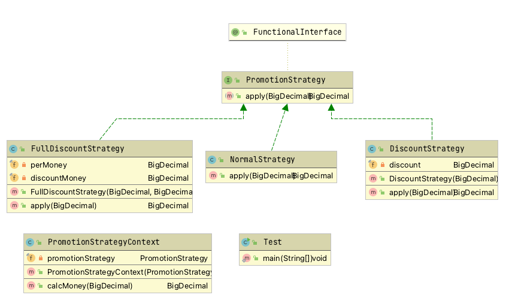

### 策略模式
它定义了算法家族，分别封装起来，让它们之间可以互相替换，此模式让算法的变化，不会影响到使用算法的客户。   
例如商城系统的各种促销方式，打折、返现、满减、送积分等，而且力度经常变化，这种就适合策略模式。  
策略模式是一种定义一系列算法的方法，从概念上来看，所有这些算法完成的都是相同的工作，只是实现不同，它可以以相同的方式调用所有的算法，减少了各种算法类 与使用算法类之间的耦合。 
策略模式的Strategy 类层次为Context 定义了一系列的可供重用的算法或行为。继承有助于析取出这些算法中的公共功能。     
策略模式的优点是简化了单元测试，因为每个算法都有自己的类，可以通过 自己的接又单独测试。  
策略模式可以封装几乎任何类型的规则，只要在分析过程中听到需要在不同时间应用不同的业务规则，就可以考虑使用策略模式处理这种变化的可能性。   




### 示例代码
```java
/**
 * 促销接口
 */
@FunctionalInterface
public interface PromotionStrategy {

    BigDecimal apply(BigDecimal money);
}
```

```java
/**
 * 无促销，直接返回
 */
public class NormalStrategy implements PromotionStrategy{

    @Override
    public BigDecimal apply(BigDecimal money) {
        return money;
    }
}
```


```java
/**
 * 满减策略
 */
public class FullDiscountStrategy implements PromotionStrategy {

    // 满
    private final BigDecimal perMoney;
    // 减
    private final BigDecimal discountMoney;

    public FullDiscountStrategy(BigDecimal perMoney, BigDecimal discountMoney) {
        // 当减的金额大于等满的金额报错。
        if (discountMoney.compareTo(perMoney) >= 0) {
            throw new RuntimeException("策略设置不合理");
        }
        this.perMoney = perMoney;
        this.discountMoney = discountMoney;
    }

    @Override
    public BigDecimal apply(BigDecimal money) {
        // 一共满了几个
        BigDecimal disCounts = money.divide(perMoney, 0, RoundingMode.HALF_UP);
        if (disCounts.compareTo(BigDecimal.ZERO) > 0) {
            // 减去
            return money.subtract(discountMoney.multiply(disCounts));
        }
        return money;
    }
}
```

```java
public class DiscountStrategy implements PromotionStrategy {

    /**
     * 打折力度
     */
    private final BigDecimal discount;

    public DiscountStrategy(BigDecimal discount) {
        if (discount.compareTo(BigDecimal.ZERO) <= 0 || discount.compareTo(BigDecimal.ONE) >= 0) {
            throw new RuntimeException("折扣必须在 0.0 ~ 1.0 之间");
        }
        this.discount = discount;
    }

    @Override
    public BigDecimal apply(BigDecimal money) {
        return money.multiply(discount).setScale(2, RoundingMode.HALF_UP);
    }
}
```

```java
public class Test {

    /**
     * 实际业务场景肯定更复杂，但是总体思维就是根据条件选择一种策略，传入 StrategyContext 然后执行具体的策略逻辑。
     */
    public static void main(String[] args) {
        NormalStrategy normalStrategy = new NormalStrategy();
        DiscountStrategy discountStrategy = new DiscountStrategy(new BigDecimal("0.8"));
        FullDiscountStrategy fullDiscountStrategy = new FullDiscountStrategy(new BigDecimal("100"), new BigDecimal("30"));


        PromotionStrategyContext promotionStrategyContext = new PromotionStrategyContext(normalStrategy);
        BigDecimal bigDecimal = promotionStrategyContext.calcMoney(new BigDecimal("100"));
        Assert.assertEquals("策略失败", 0, bigDecimal.compareTo(new BigDecimal("100")));
        System.out.println("不打折策略成功");


        promotionStrategyContext = new PromotionStrategyContext(discountStrategy);
        bigDecimal = promotionStrategyContext.calcMoney(new BigDecimal("100"));
        Assert.assertEquals("策略失败", 0, bigDecimal.compareTo(new BigDecimal("80")));
        System.out.println("打折策略成功");

        promotionStrategyContext = new PromotionStrategyContext(fullDiscountStrategy);
        bigDecimal = promotionStrategyContext.calcMoney(new BigDecimal("100"));
        Assert.assertEquals("策略失败", 0, bigDecimal.compareTo(new BigDecimal("70")));
        System.out.println("满减策略成功");


        PromotionStrategy noNameStrategy = e -> e;
        promotionStrategyContext = new PromotionStrategyContext(noNameStrategy);
        bigDecimal = promotionStrategyContext.calcMoney(new BigDecimal("100"));
        Assert.assertEquals("策略失败", 0, bigDecimal.compareTo(new BigDecimal("100")));
        System.out.println("函数式策略成功");
    }
}

// 测试结果
Connected to the target VM, address: '127.0.0.1:56225', transport: 'socket'
不打折策略成功
打折策略成功
满减策略成功
函数式策略成功
Disconnected from the target VM, address: '127.0.0.1:56225', transport: 'socket'
```