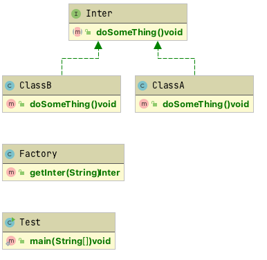

## 工厂模式
### UML




### 代码实现

```java
// 接口
public interface Inter {

    void doSomeThing();
}
```

```java
// 实现类A
public class ClassA implements Inter{

    @Override
    public void doSomeThing() {
        System.out.println("this is class A");
    }
}
```

```java
// 实现类B
public class ClassB implements Inter{

    @Override
    public void doSomeThing() {
        System.out.println("this is class B");
    }
}
```

```java
// 工厂类
// 如果使用 Spring 可以直接通过 Spring 上下文 getBean 获取对象。
public class Factory {

    public Inter getInter(String name) {

        if (name == null) return null;

        if (name.equals("classA")) {
            return new ClassA();
        } else if (name.equals("classB")) {
            return new ClassB();
        } else {
            return null;
        }
    }
}
```

```java
// 使用工厂模式。
public class Test {

    public static void main(String[] args) {
        Factory factory = new Factory();
        Inter classA = factory.getInter("classA");
        Inter classB = factory.getInter("classB");
        classA.doSomeThing();
        classB.doSomeThing();
    }
}
```

### 优势
首先符合开闭原则，ClassA 和 ClassB 进行了封装，如果以后增加 ClassC, 对 ClassA 和 ClassB 是完全无影响的。  
对比所有的创建对象逻辑都在 Test 里实现，业务代码无需关心对象是怎么创建的，只需要把想要的对象名传给工厂类即可。  
### 略势
缺点就是增加了实现，需要在工厂类进行修改。所以复杂的对象创建建议使用工厂模式。