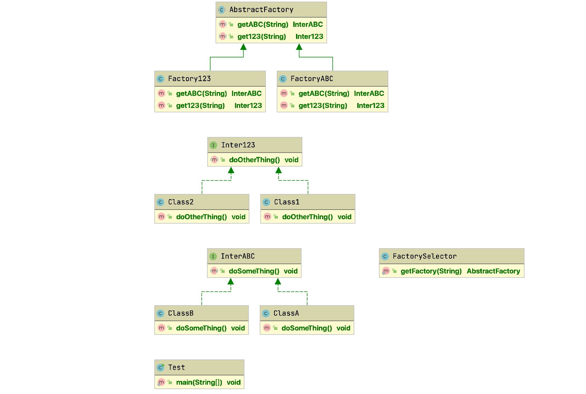

## 抽象工厂模式

### UML


```java
public abstract class AbstractFactory {

    public abstract InterABC getABC(String abc);

    public abstract Inter123 get123(String num);
}
```

```java
public class FactoryABC extends AbstractFactory{

    @Override
    public InterABC getABC(String abc) {
        if(abc == null){
            return null;
        }
        if(abc.equalsIgnoreCase("classA")){
            return new ClassA();
        } else if(abc.equalsIgnoreCase("classB")){
            return new ClassB();
        } else {
            return null;
        }
    }

    @Override
    public Inter123 get123(String num) {
        return null;
    }
}
```

```java
public class Factory123 extends AbstractFactory {

    @Override
    public InterABC getABC(String abc) {
        return null;
    }

    @Override
    public Inter123 get123(String num) {
        if (num == null) {
            return null;
        }
        if (num.equalsIgnoreCase("class1")) {
            return new Class1();
        } else if (num.equalsIgnoreCase("class2")) {
            return new Class2();
        } else {
            return null;
        }
    }
}
```

```java
public class FactorySelector {

    public static AbstractFactory getFactory(String choice) {

        if (choice.equalsIgnoreCase("abc")) {
            return new FactoryABC();
        } else if (choice.equalsIgnoreCase("123")) {
            return new Factory123();
        } else {
            return null;
        }
    }
}
```

```java
public interface InterABC {

    void doSomeThing();
}
```

```java
public class ClassA implements InterABC {

    @Override
    public void doSomeThing() {
        System.out.println("this is class A");
    }
}
```

```java
public class ClassB implements InterABC {

    @Override
    public void doSomeThing() {
        System.out.println("this is class B");
    }
}
```

```java
public interface Inter123 {

    void doOtherThing();
}
```

```java
public class Class1 implements Inter123{

    @Override
    public void doOtherThing() {
        System.out.println("this is class 1");
    }
}
```

```java
public class Test {

    public static void main(String[] args) {

        AbstractFactory abc = FactorySelector.getFactory("abc");
        AbstractFactory num = FactorySelector.getFactory("123");

        InterABC classA = abc.getABC("classA");
        Inter123 class1 = num.get123("class1");

        classA.doSomeThing();
        class1.doOtherThing();
    }
}
```
### 目的
提供一个创建一系列相关或相互依赖对象的接口，而无需指定它们具体的类。

他对比简单工厂，可以创建多个类型的对象。先根据类型获取不同的类型的工厂，再根据工厂去获取具体的对象。

优点：当一个产品族中的多个对象被设计成一起工作时，它能保证客户端始终只使用同一个产品族中的对象。  
缺点：产品族扩展非常困难，要增加一个系列的某一产品，既要在抽象的 Creator 里加代码，又要在具体的里面加代码。