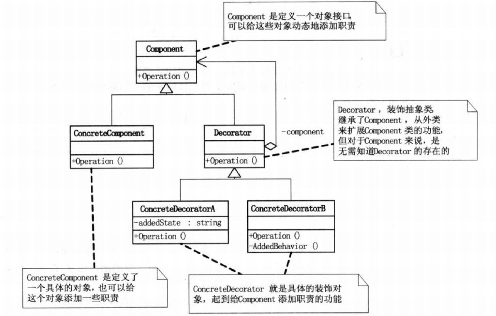

## 装饰模式
动态地给一个对象添加一些额外的职责，就增加功能来说，装饰模式比生成子类更灵活。  
装饰模式是为已有功能动态地添加更多功能的一种方式。  
当系统需要新功能的时候，是向旧的类中添加新的代码。这些新加的代码通常装饰了原有类的核心职责或主要行为。  
而这些新加入的东西仅仅是为了满足一些只在某种特定情况下才会执行的特殊行为的需要。  
而装饰模式却提供了一个非常好的解决方案，它把每个要装饰的功能放在单独的类中，并让这个类包装它所要装饰的对象，因此，当需要执行特殊行为时，客户代码就可以在运行时根 据需要有选择地、按顺序地使用装饰功能包装对象了。  
装饰模式的优点是，把类中的装饰功能从类中搬移去除，这样可以简化原有的类。  

> 装饰模式和建造者模式的区别  
> 建造者模式是固定的，要建造哪些属性都是固定的，比如构造一个人，一个头一个身体四条腿，都是固定的，而装饰着模式就像是穿衣服，可以穿外套，鞋子，袜子，也可以什么都不穿，对于类的稳定性没有要求，只不过通过不同的装饰产生不同的组合效果。

**说了一大堆，其实装饰模式就是我们有一个 ClassA, 创建了一个装饰类ClassB，用来包装原有的类ClassA，并在保持类方法签名完整性的前提下，提供了额外的功能**

### 装饰模式UML




### 装饰模式代码示例

```java
// 原始类
public interface Inter {
   void doSomething();
}

public class ClassA implements Inter {
 
   @Override
   public void doSomething() {
      System.out.println("class a");
   }
}
public class ClassB implements Inter {
 
   @Override
   public void doSomething() {
      System.out.println("class b");
   }
}
```

```java
// 装饰类
public abstract class Decorator implements Inter {
   protected Inter decoratedInter;
 
   public Decorator(Inter decoratedInter){
      this.decoratedInter = decoratedInter;
   }
 
   public void doSomething(){
      decoratedInter.doSomething();
   }  
}

public class DecoratorA extends Decorator {
 
   public DecoratorA(Inter inter) {
      super(inter);     
   }
 
   @Override
   public void doSomething() {
      decoratedInter.doSomething();         
      doSomeDecorator(decoratedInter);
   }
 
  // 装饰类有原始类对象，就可以做一些增强。
   private void doSomeDecorator(Inter decoratedInter){
      System.out.println("do some decorator");
   }
}