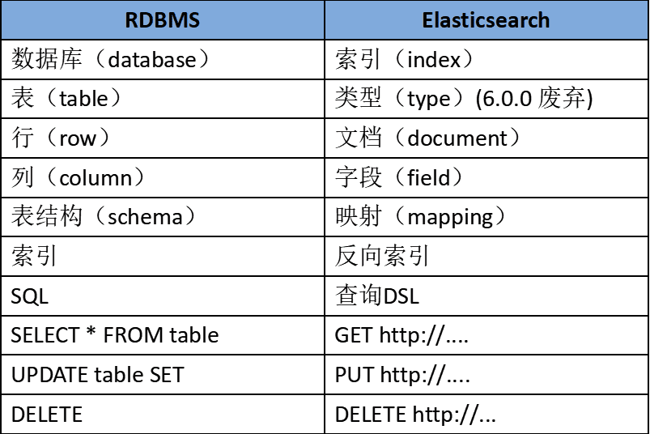

## ElasticSearch 主要功能和使用场景
### 主要功能
1，海量数据存储以及集群管理。  
2，支持结构化数据，非结构化数据，地理位置等近实时搜索。  
3，海量数据的近实时分析。  
### 使用场景
搜索，日志，指标监控，分析，安全分析。
## ElasticSearch基础概念

## ElasticSearch 原理
### 分布式架构原理
首先把 ES 集群部署，在多台机器上启动多个 ES 进程实例，组成一个 ES 集群。在 ES 的集群部署的基础之上，ES 的分布式架构主要是通过对`索引`数据分片和数据备份。  
1. 通过将 `index` 拆分成多个 `shard` 也提高了数据的扩展能力，和查询性能。  
2. 通过对每个 `shard` 的备份 `replica`，来保证数据的完整性和可用性， `shard` 分为 `primary shard` 和 `replica shard`。   
3. 例如有 3 台服务器组成的 ES 集群，某个 index 有 3 个分片，每个分片有 1 个副本，那么就会有 3 个 `primary shard` 和 3 个 `replica shard`。那么 3 个 `primary shard` 分布在 3 台服务器上，3 个 `replica shard` 分布在另外 3 台服务器上。而且 `primary shard` 和 对应的 `replica shard` 不会在同一台服务器上。如果集群中某个节点宕机，那么对应的 `primary shard` 和 `replica shard` 会自动切换到其他节点上，其他的 2 台服务器的数据是能够保证整个集群的数据的完整性的。

### 写入数据过程
1. 客户端会选择一个 node 发送请求，这个 node 就是协调节点。
2. 协调节点会对写入的 doc 进行路由，将请求转发给对应的有 primary shard 的 node。
3. 被选中的 node 处理请求，将数据写入 primary shard，然后将数据同步给对应的 replica shard。
4. 协调节点等待写处理完成，数据同步完成后，返回响应结果给客户端。

### 读取数据过程
1. 客户端会选择一个 node 发送请求，这个 node 就是协调节点。
2. 协调节点会对查询的 doc id 进行 hash，判断出数据在那个分片上，然后通过随机轮询算法在该 shard 的 primary shard 和所有的 replica shard 中随机选择一个，处理请求。
3. 实际处理的 node 会将 doc 数据返回给协调节点。
4. 协调节点将数据返回给客户端。

### 搜索过程
1. 客户端会选择一个 node 发送请求，这个 node 就是协调节点。
2. 协调节点将搜索请求转发给所有的 shard (每个 shard 的主分片或者备份分片都可)。
3. query phase 查询阶段：每个 shard 将搜索结果返回给协调节点。协调器节点将各个 shard 的结果进行合并、排序、分页，得到最终结果。
4. fetch phase 取数据阶段：协调节点根据查询结果，去各个 shard 上取数据，可以参考读取数据过程，通过搜索查到的 doc id 去各个分片读取数据，最终把所有数据返回给客户端。

### 如何提高查询效率

