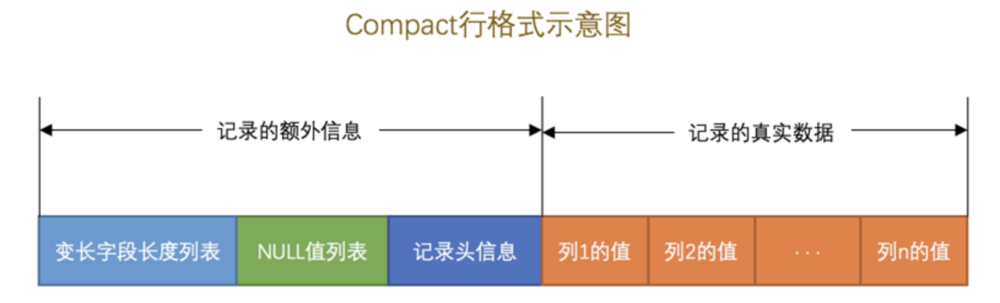

## InnoDB 存储引擎
mysql 数据库有很多种数据引擎，例如 MyISAM 和 InnoDB，为了支持事务，目前最常用的是 InnoDB 存储引擎。

### InnoDB 的数据存储
InnoDB 是以页的形式存储数据的，InnoDB 将数据划分为若干个页，以页作为磁盘和内存之间交互的基本单位，InnoDB中页的大小一般为 16 KB。也就是在一般情况下，一次最少从磁盘中读取 16KB 的内容到内存中，一次最少把内存中的 16KB 内容刷新到磁盘中。

### InnoDB 的行格式
InnoDB 支持四种行格式分别是 Compact、Redundant、Dynamic 和 Compressed。
所谓的行格式，就是在 InnoDB 中存储一条数据的具体格式，也称为纪录格式。
```sql
-- 设置行格式
CREATE TABLE 表名 (列的信息) ROW_FORMAT=行格式名称
ALTER TABLE 表名 ROW_FORMAT=行格式名称
```
#### Compact 行格式

compact 行格式分为纪录的额外信息和纪录的真实数据。

##### 纪录的额外信息
1. 变长字段的`长度`列表：  
纪录数据行中所有变长字段(varchar, text, blob等)的长度，按照字段的顺序的逆序存储。例如 col1 = varchar(10)，实际长度 3，col2 = varchar(20)，实际长度 4，那么此处存放的是 4，3 的二进制编码。  
```text
至于此处存放长度 `4`，`3` 的具体字段长度则使用以下规则计算：  
W = 字符的最大长度，utf8 = 3, utf8mb4 = 4。
M = 变成字段的最大长度，varchar(10), M = 10。
L = 实际存储的字段长度，例如 varchar(10)，实际长度 3，那么 L = 3。

那么每个长度使用的字节长度 len 计算公式如下：
if(M * W <= 255){
    len = 1;
}else if(M * W > 255){
    if(L <= 127) {
        len = 1;
    }else{
        l == 2;
    }
}
```
> ps1: 变长字段存储的值`不为 null`，才会在变长字段长度列表有值。  
> ps2: 并不是所有记录都有 `变长字段长度列表` 部分，如果表中所有的列都不是变长的数据类型，这一部分就不需要有。
##### 纪录的真实数据


## Explain

### 示例
```sql
EXPLAIN SELECT * FROM users WHERE username = 'zhangsan';
```

`EXPLAIN` 的输出如下：

```
+----+-------------+-------+------------+------+---------------+---------+---------+-------+------+----------+-------------+
| id | select_type | table | partitions | type | possible_keys | key     | key_len | ref   | rows | filtered | Extra       |
+----+-------------+-------+------------+------+---------------+---------+---------+-------+------+----------+-------------+
|  1 | SIMPLE      | users | NULL       | ref  | idx_username  | idx_username | 102   | const |    1 |   100.00 | Using where |
+----+-------------+-------+------------+------+---------------+---------+---------+-------+------+----------+-------------+
```

- `id`：`1`，表示这个查询是一个简单查询。对于复杂的查询，如带有子查询或联合查询的，`id` 值可能会不同。
- `select_type`：`SIMPLE`，表示这是一个没有子查询的简单查询。
- `table`：`users`，查询的表是 `users`。
- `type`：`ref`，表示使用了索引扫描 *** 。
- `possible_keys`：`idx_username`，表示可能使用的索引是 `idx_username`。
- `key`：`idx_username`，实际使用的索引是 `idx_username`。
- `key_len`：`102`，表示索引键的长度是 102 字节。
- `ref`：`const`，表示查询条件是一个常量。
- `rows`：`1`，表示预计扫描 1 行。
- `filtered`：`100.00`，表示过滤条件通过的百分比是 100%。
- `Extra`：`Using where`，表示查询使用了 `WHERE` 条件过滤。

### select_type：`SELECT` 语句的类型，表示查询的类型。常见的类型有：
  - `SIMPLE`：简单查询，不包含子查询或联合查询。
  - `PRIMARY`：主查询，即最外层的查询。
  - `UNION`：`UNION` 操作的第二个或后续的查询。
  - `DEPENDENT UNION`：依赖于外部查询的 `UNION`。
  - `SUBQUERY`：子查询。
  - `DEPENDENT SUBQUERY`：依赖于外部查询的子查询。
  - `DERIVED`：派生表（临时表）。

### type：表访问方式，表示 MySQL 如何查找满足条件的行。访问方式的效率从高到低包括：
  - `system`：系统表，表中只有一行。
  - `const`：常量表，表中最多有一个匹配行。
  - `eq_ref`：唯一索引扫描，对于每个索引键值访问一个表中的一行。
  - `ref`：非唯一索引扫描，返回所有匹配的行。
  - `range`：索引范围扫描。
  - `index`：全索引扫描。
  - `ALL`：全表扫描。

### Extra：额外的信息，描述查询执行的详细情况。常见的值包括：
  - `Using index`：查询使用了覆盖索引。
  - `Using where`：查询使用了 `WHERE` 条件过滤。
  - `Using temporary`：查询使用了临时表。
  - `Using filesort`：查询使用了文件排序，表示需要额外的排序步骤。

## 分库分表
## 深度分页
## 冷热数据
## 数据库优化


## 参考
[深入理解 Mysql 索引底层原理](https://zhuanlan.zhihu.com/p/113917726)  
[next-key锁定范围](https://segmentfault.com/a/1190000040129107)  
[索引之道](https://juejin.cn/post/7161964571853815822)  
[MySQL 是怎样运行的：从根儿上理解 MySQL](https://relph1119.github.io/mysql-learning-notes/#/)
[两万字详解InnoDB的锁](https://juejin.cn/post/7094049650428084232)