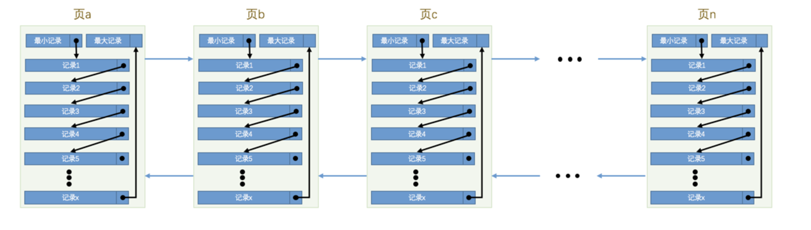

## MySQL 存储引擎
mysql 数据库有很多种数据引擎，例如 MyISAM 和 InnoDB，为了支持事务，目前最常用的是 InnoDB 存储引擎。

## InnoDB 的数据存储
InnoDB 是以页的形式存储数据的，InnoDB 将数据划分为若干个页，以页作为磁盘和内存之间交互的基本单位，InnoDB中页的大小一般为 16 KB。也就是在一般情况下，一次最少从磁盘中读取 16KB 的内容到内存中，一次最少把内存中的 16KB 内容刷新到磁盘中。

## InnoDB 的行格式
InnoDB 支持四种行格式分别是 Compact、Redundant、Dynamic 和 Compressed。
所谓的行格式，就是在 InnoDB 中存储一条数据的具体格式，也称为纪录格式。
```sql
-- 设置行格式
CREATE TABLE 表名 (列的信息) ROW_FORMAT=行格式名称
ALTER TABLE 表名 ROW_FORMAT=行格式名称
```
### Compact 行格式

compact 行格式分为纪录的额外信息和纪录的真实数据。

#### 纪录的额外信息
1. 变长字段的`长度`列表：  
纪录数据行中所有变长字段(varchar, text, blob等)的长度，按照字段的顺序的逆序存储。例如 col1 = varchar(10)，实际长度 3，col2 = varchar(20)，实际长度 4，那么此处存放的是 4，3 的二进制编码。  
```text
至于此处存放长度 `4`，`3` 的具体字段长度则使用以下规则计算：  
W = 字符的最大长度，utf8 = 3, utf8mb4 = 4。
M = 变成字段的最大长度，varchar(10), M = 10。
L = 实际存储的字段长度，例如 varchar(10)，实际长度 3，那么 L = 3。

那么每个长度使用的字节长度 len 计算公式如下：
if(M * W <= 255){
    len = 1;
}else if(M * W > 255){
    if(L <= 127) {
        len = 1;
    }else{
        l == 2;
    }
}
```
> **PS1**: 变长字段存储的值`不为 null`，才会在变长字段长度列表有值。  
> **PS2**: 并不是所有记录都有 `变长字段长度列表` 部分，如果表中所有的列都不是变长的数据类型，这一部分就不需要有。  
> **PS3**: 对于 char(x) 类型的列来说，当列采用的是定长字符集时，该列占用的字节数不会被加到变长字段长度列表，而如果采用变长字符集时，该列占用的字节数也会被加到变长字段长度列表。例如 utf8，char(8) 这一列不为 null，长度也在变成字段长度列表中。

2. null 值列表  
表中所有可以为 null 的字段都会映射成一位在 null 值列表中。  
按照列的逆序存储。  
根据可以为 null 的字段数，决定位数，例如 7 个可以为 null 的字段，那么 null 值列表长度为 1 个字节，如果 12 个可以为空的字段，那么 null 值列表长度为 2 个字节。必须占有整个字节，不足的在高位补 0。  
按照***逆序***，对应的字段的值为 null，则该位为 1，如果该位对象的字段值不是 null，则该位为 0。
```sql
c1 varchar null,
c2 varchar null, 值为 "hello"
c3 varchar not null;

                c3 c2 c1
null 列表 0000 0 1  0  1
null 列表存储的就是 0x05
```

3. 纪录头信息
纪录头信息共 5 个字节，40 位，如下图。


| 名称            | 大小（单位：bit） | 描述                                                         |
|-----------------|------------------|------------------------------------------------------------|
| **预留位1**     | 1                | 没有使用，可能用于未来扩展功能或保留特定位置信息。               |
| **预留位2**     | 1                | 没有使用，与预留位1类似，用于扩展功能或特定位置信息保留。          |
| **delete_mask** | 1                | 标记该记录是否被删除，1表示记录已被删除，0表示记录有效。          |
| **min_rec_mask**| 1                | B+树中，每层非叶子节点的最小记录都会带有该标记，便于树的层次结构管理。 |
| **n_owned**     | 4                | 表示当前记录拥有的记录数，主要用于计算记录分布和空间管理。          |
| **heap_no**     | 13               | 当前记录在记录堆中的位置信息，用于快速索引和定位。                |
| **record_type** | 3                | 表示记录类型：**0**：普通记录，**1**：B+树非叶子节点记录，**2**：最小记录，**3**：最大记录  |
| **next_record** | 16               | 当前记录与下一条记录的相对位置，用于记录链的维护和遍历。           |

```text
纪录头信息详解：
delete_mask：标记当前纪录是否被删除，1 = 已删除，所有的被删除的记录会组成一个垃圾链表，
这种已删除的记录称为可重用空间，如果有新记录，可能会覆盖掉某条 delete_mask = 1 的记录。

min_rec_mask：标记在 B+ 树中，是否是当前层级最小的非叶子节点，如果是则该标记 = 1。

n_owned：mysql有数据页目录的概念，会把所有的记录都分成组，
每个组的最大的记录中的这个字段，表示当前组拥有的记录数。

heap_no：表示当前记录在本页中的位置。从 2 开始计数，因为每个页都有两个虚拟记录，
分别是最小记录和最大记录， 0 = 最小记录，1 = 最大记录，最大记录最小记录的值是固定的，分别是 infimun 和 supremum。
这两个记录存放在页中 user_records 位置之前。

record_type: 当前记录的类型，具体见上表。

next_record：表示当前记录的真实数据到下一条记录的真实数据的地址偏移量。
例如 next_recode = 10，那么从第一条记录的真实地址往后找 10 个字节，就是下一条记录的真实数据。
这里的下一条记录并不是插入的下一条记录，而是通过主键排序后的下一条记录，而且是 infimun -> 1 -> 2 -> 3 -> supremum;
```

#### 纪录的真实数据
纪录的真实数据除了数据外，还有一些隐藏字段。
| 列名             | 是否必须 | 占用空间 | 描述                     |
|------------------|----------|----------|--------------------------|
| **row_id**(DB_ROW_ID)       | 否       | 6字节    | 行ID，唯一标识一条记录     |
| **transaction_id**(DB_TRX_ID) | 是       | 6字节    | 事务ID                   |
| **roll_pointer**(DB_ROLL_PTR)  | 是       | 7字节    | 回滚指针                 |

其中 row_id 不是必须的，如果定义的数据表没有指定主键，则会添加一个隐藏的 row_id 作为主键。  
transaction_id 和 roll_pointer 则是 InnoDB 引擎中所有纪录都有的隐藏字段。

### Redundant行格式
Redundant 行格式是 MySQL5.0 之前用的一种行格式，忽略。

### Dynamic行格式
MySQL5.7 版本引入的 Dynamic 行格式是 compact 格式的升级版本。它延续了 compact 格式的优势，在处理大型可变长度列时更具灵活性，能够灵活选择将数据存储在页内还是页外。 Dynamic 格式适用于多数应用场景，在存储空间和性能之间取得了一定的平衡。其结构与 compact 格式大致相似。

与 compact 行格式不同之处在行溢出的处理，compact 行格式在处理行溢出的时候，会把前 768 个字节放在索引页中，其他的放在 blob 页中，并通过地址指向这个页地址。  
而dynamic 是把所有的字节都存储到 blob 页面中，只在记录的列的真实数据处存储其他页面的地址。

### Compressed行格式
Compressed 行格式在 MySQL5.1 中被 InnoDB 引入，它提供了压缩功能能够减小数据在磁盘上的占用空间，其缺点在于增加了 CPU 的负担，可能导致部分查询性能下降。  
Compressed 行格式在 Dynamic 行格式的基础上引入了页外压缩功能。在存储数据时，如果发现可以通过压缩来减小存储空间，系统将选择压缩方式来存储数据。在查询时，数据将会被自动解压并返回结果。

### 行溢出
mysql 限制了一行数据除了 TEXT，BLOB，最多占用 65535 字节空间，这个 65535 除了列本身的数据，还有一些额外的数据，例如 varchar(x) 除了真实数据，还有占用字节长度，NULL 标识等。  

如果 varchar(x) 类型的列使用的不是 ascii 字符集，那 x 的最大取值取决于该字符集表示一个字符最多需要的字节数。在列的值允许为 NULL 的情况下，gbk 字符集表示一个字符最多需要 2 个字节，那在该字符集下，x 的最大取值就是32766（也就是：65532/2），也就是说最多能存储 32766 个字符；utf8 字符集表示一个字符最多需要 3 个字节，那在该字符集下，x 的最大取值就是 21844，就是说最多能存储 21844（也就是：65532/3）个字符。

在 Compact 和 Reduntant 行格式中，对于占用存储空间非常大的列，在记录的真实数据处只会存储该列的一部分数据（前 768 字节），把剩余的数据分散存储在几个其他的页中，然后记录的真实数据处用 20 个字节存储指向这些页的地址，从而可以找到剩余数据所在的页。

MySQL 规定一个页至少存放 2 条纪录，没个页需要额外的信息是 127 个字节，每条纪录需要额外的信息是 27 个字节，所以 136 + 2(27 + n) > 16384, n = 8098。如果表只有一个 varchar 字段，字段存放 8098 个字节的内容，就会发生行溢出。

## InnoDB 的页
InnoDB 有很多中页，Insert Buffer 页，undo 日志页等等，存放表数据的页称为索引页(index)，也称为数据页。  
数据页的结构：  


| 名称                  | 中文名           | 占用空间大小 | 简单描述                        |
|-----------------------|------------------|--------------|---------------------------------|
| **File Header**       | 文件头部         | 38字节       | 页的一些通用信息                 |
| **Page Header**       | 页面头部         | 56字节       | 数据页专有的一些信息             |
| **Infimum + Supremum**| 最小记录和最大记录 | 26字节       | 两个虚拟的行记录                 |
| **User Records**      | 用户记录         | 不确定       | 实际存储的行记录内容             |
| **Free Space**        | 空闲空间         | 不确定       | 页中尚未使用的空间               |
| **Page Directory**    | 页面目录         | 不确定       | 页中的某些记录的相对位置         |
| **File Trailer**      | 文件尾部         | 8字节        | 校验页是否完整                   |

表数据就是以行格式存储在 User Records 中。

### 页目录 Page Directory
MySQL 引入页目录主要是为了快速查找记录。  
MySQL 查询记录，总不能把所有的记录都遍历一遍，那样效率是特别低的。  
所以 InnoDB 就把所有的数据记录都分成了组，每个组的最后一条记录，即组内主键序最大的记录的 n_owned 属性会记录当前组有多少个记录。   
并且每个组的最后一条记录的地址偏移量放到页的尾部，这里就是 Page Directory，这些地址偏移量也被称为 slot，所以也可以说 Page Directory 由 slot 组成的。
> 如果页内有 n 条记录，被分成了 x 个组，那个 Page Directory 内就有 x 个记录（slot）。  

> 1. 记录分组规则：对于最小记录所在的分组只能有 1 条记录，最大记录所在的分组拥有的记录条数只能在 1~8 条之间，剩下的分组中记录的条数范围只能在是 4~8 条之间。  
> 2. 没有数据的情况下，只有最小记录 infimum 和最大记录 supremum 两条记录，它们分属于两个分组。  
> 3. 随着数据加入，每次都会从页目录中找到主键值比本记录的主键值大并且差值最小的槽，然后把该槽对应的记录的 n_owned 值加1，表示本组内又添加了一条记录，直到该组中的记录数等于8个。  
> 4. 在一个组中的记录数等于 8 个后再插入一条记录时，会将组中的记录拆分成两个组，一个组中 4 条记录，另一个 5 条记录。这个过程会在页目录中新增一个槽来记录这个新增分组中最大的那条记录的偏移量。

有了页目录只有再查询数据就很快了，第一步先通过二分查找，定位记录所在的 slot 并找到该 slot 的主键最小的记录，第二部通过最小记录的 next_record 遍历该 slot 内的记录。

### 页头部 Page Header
PageHeader 内容固定位 56 个字节，内容如下：
# InnoDB 数据页结构字段说明

| 名称                 | 占用空间大小 | 描述                                                                                      |
|----------------------|--------------|-------------------------------------------------------------------------------------------|
| `PAGE_N_DIR_SLOTS`   | 2 字节        | 在页目录中的槽数量，表示该页中二级索引记录目录项的数量。                                    |
| `PAGE_HEAP_TOP`      | 2 字节        | 页中尚未使用空间的最小地址，从该地址往后为可用的 Free Space（空闲空间）。                    |
| `PAGE_N_HEAP`        | 2 字节        | 当前页中的记录总数，包括最小记录（infimum）、最大记录（supremum）以及标记为删除的记录。        |
| `PAGE_FREE`          | 2 字节        | 第一个已标记为删除的记录地址，这些记录通过 `next_record` 链接成一个单链表，可供重新利用。      |
| `PAGE_GARBAGE`       | 2 字节        | 已删除记录所占用的字节数。                                                                 |
| `PAGE_LAST_INSERT`   | 2 字节        | 最后插入记录的位置。                                                                       |
| `PAGE_DIRECTION`     | 2 字节        | 记录插入的方向。                                                                           |
| `PAGE_N_DIRECTION`   | 2 字节        | 一个方向上连续插入的记录数量。                                                             |
| `PAGE_N_RECS`        | 2 字节        | 页中记录的数量（不包括最小记录、最大记录和已标记为删除的记录）。                            |
| `PAGE_MAX_TRX_ID`    | 8 字节        | 修改当前页的最大事务 ID，仅在二级索引页中定义。                                            |
| `PAGE_LEVEL`         | 2 字节        | 当前页在 B+ 树中的层级。                                                                   |
| `PAGE_INDEX_ID`      | 8 字节        | 索引 ID，表示当前页属于哪个索引。                                                          |
| `PAGE_BTR_SEG_LEAF`  | 10 字节       | B+ 树叶子段的头部信息，仅在 B+ 树的 Root 页中定义。                                         |
| `PAGE_BTR_SEG_TOP`   | 10 字节       | B+ 树非叶子段的头部信息，仅在 B+ 树的 Root 页中定义。                                       |

Page Header 主要是记录数据页的记录的各种状态信息。比如记录数，slot 数量，页的最大事务 ID 等等。

### 文件头部 File Header
File Header 是页的第一部分，内容固定位 38 个字节，如下：

| 名称                                | 占用空间大小 | 描述                                                                                  |
|-------------------------------------|--------------|---------------------------------------------------------------------------------------|
| `FIL_PAGE_SPACE_OR_CHKSUM`          | 4 字节        | 页的校验和（checksum 值）。                                                            |
| `FIL_PAGE_OFFSET`                   | 4 字节        | 页号。                                                                                |
| `FIL_PAGE_PREV`                     | 4 字节        | 上一个页的页号。                                                                      |
| `FIL_PAGE_NEXT`                     | 4 字节        | 下一个页的页号。                                                                      |
| `FIL_PAGE_LSN`                      | 8 字节        | 页面最后被修改时对应的日志序列位置（Log Sequence Number，简称 LSN）。                   |
| `FIL_PAGE_TYPE`                     | 2 字节        | 页的类型。                                                                            |
| `FIL_PAGE_FILE_FLUSH_LSN`           | 8 字节        | 仅在系统表空间的一个页中定义，表示文件至少被刷新到了对应的 LSN 值。                      |
| `FIL_PAGE_ARCH_LOG_NO_OR_SPACE_ID`  | 4 字节        | 表示页属于哪个表空间。                                                                |

File Header 主要记录页号，上一页，下一页等。  
整个 InnoDB 的所有的数据页，就是通过 FIL_PAGE_PREV, FIL_PAGE_NEXT 串联起来的一个大链表。

FiL_PAGE_TYPE 是指页的类型，所有的类型如下：

| 类型名称                    | 十六进制  | 描述                            |
|-----------------------------|-----------|---------------------------------|
| `FIL_PAGE_TYPE_ALLOCATED`   | `0x0000`  | 最新分配，还未使用。             |
| `FIL_PAGE_UNDO_LOG`         | `0x0002`  | Undo 日志页。                   |
| `FIL_PAGE_INODE`            | `0x0003`  | 段信息节点。                     |
| `FIL_PAGE_IBUF_FREE_LIST`   | `0x0004`  | Insert Buffer 空闲列表。         |
| `FIL_PAGE_IBUF_BITMAP`      | `0x0005`  | Insert Buffer 位图。             |
| `FIL_PAGE_TYPE_SYS`         | `0x0006`  | 系统页。                         |
| `FIL_PAGE_TYPE_TRX_SYS`     | `0x0007`  | 事务系统数据页。                 |
| `FIL_PAGE_TYPE_FSP_HDR`     | `0x0008`  | 表空间头部信息页。               |
| `FIL_PAGE_TYPE_XDES`        | `0x0009`  | 扩展描述页。                     |
| `FIL_PAGE_TYPE_BLOB`        | `0x000A`  | BLOB 页。                        |
| `FIL_PAGE_INDEX`            | `0x45BF`  | 索引页，即 数据页。      |

### 页文件尾 File Trailer
File Trailer 和 File Header 都是所有的文件类型的页都有的结构，File Trailer 一共 8 个字节，前 4 个代表页的校验和，后 4 个字节代表页面被修改时对于的日志序列位置。  

file Trailer 存在的意义主要是为了页的完整性。

### 页分裂
MySQL 中的页能够存放的数据是有限的，比如页内有 1，3，5，7，四条记录，而且页满了，如果我们想要再添加一条记录 4，
那么就需要新分配一个页，并且加入页链表中，把 4 加入 1，3，5之间，形成 1，3，4，5，记录 7 则放入新页中，这种情况就是所谓的页分裂。

## 索引
InnoDB 底层数据存储可以理解成一个一个的页，所有的页之间同过 File Header 中的指针形成一个双向链表，页内的数据又按照主键序形成了单向链表，而且页内还有页目录的概念，把页内的所有的记录都分了组。

具体的结构如下图：  


那么在没有索引的情况，查询一条记录怎么做呢：
1. 先定位到页，由于也没有索引，只能通过链表，从头到尾按照遍历一边，定位到记录所在的页。
2. 在页内，如果是主键查询，可以在页目录中二分查找快速定位到记录组，在查找到记录，如过是非主键列，只能遍历页内的单向链表，定位到具体的记录。

### 索引的设计
所以为了增加查询效率，InnoDB 引入了索引页，索引页的格式和数据页的格式几乎一样。最大的区别就是索引页内存储的是索引项记录，这个记录和普通数据项的结构也差不多，不过它除了 InnoDB 添加的隐藏列之外只有主键值和页号两列。
> 主键值记录普通数据项的主键，页号记录该主键所在的页的页号。索引页的 FIL_PAGE_INDEX 和数据页的 FIL_PAGE_INDEX 都是 0x45BF；

目录项记录的记录头里的 record_type = 1，而普通的数据记录项目 record_type = 0。  
索引页本身又形成了一个双向链表，而且由于目录项记录只有两个字段，所以一个页可以存储的数据就非常多。

那有了索引之后，再去查询一个数据，步骤如下：  
1. 先通过目录项记录的页，在页内通过二分快速查找到对象的记录所在的数据页。
2. 再在数据页内通过二分，快递定位到具体的记录。这样查询一个数据的时间复杂度，就从 O(n)，降低到了 O(logN)；

如果数据量特别多，索引页也会进行页分裂，如果索引页特别多，就会再往上形成新的一层索引层，这样就形成了一个 B+ 数的结构，如下图：  


> 那么 B+ 树会非常高吗？  
> 假设一个数据页可以存放 100 条记录，一个索引页可以存放 1000 条数据。  
> 那么一层索引 1000 * 100，二层 1000 * 1000 * 100，三层 1000 * 1000 * 100，四层 1000 * 1000 * 1000 * 100，一般来说，索引都不会超过四层。

### 聚簇索引
聚簇索引所有完整的用户记录都存放在这个聚簇索引的叶子节点处。InnoDB存储引擎会自动的为我们创建聚簇索引。在InnoDB存储引擎中，聚簇索引就是数据的存储方式，也就是所谓的索引即数据，数据即索引。

它有两个特点：  
1. 记录和页都按照主键序排序。
2. B+ 树的叶子节点存储完整的用户记录。

### 二级索引
所谓的二级索引就是使用指定的列再建立一个索引树，结构基本和聚簇索引相同。  
它和聚簇索引的区别如下：  
1. 二级索引使用指定的列进行排序。
2. 二级索引的页内单链表和页间双链表都是使用指定的列来排序的。
3. 二级索引的叶子节点存储的不是主键值和页号，而是指定列的值和主键值。
4. 二级索引的非叶子节点，即目录项记录里存放的不是主键+页号，而是指定列的值+页号。
> 二级索引指定的列不一定是唯一的，为了目录项记录的唯一性，目录项并不仅仅是索引列+页号，而是索引列+主键+页号。

#### 二级索引查找过程
1. 从二级索引根页，可以快速定位到目录项记录所在的页。
2. 通过目录项记录页确定用户记录真实所在的页。
3. 在真实存储用户记录的页中定位到具体的记录。
4. 二级索引叶子节点中的记录只存储了索引列和主键列，所以需要再根据主键值去聚簇索引中再查找一遍完整的用户记录（这就是所谓的回表）。
> 如果查询的信息只有索引列，就不需要再通过主键去聚簇索引中查询所有的记录，这种查询过程，就叫索引覆盖。

### 联合索引
所谓的联合索引就是使用多个列进行排序，并构建索引，例如索引列（a,b)，就是先通过 a 排序，a 相同的，再使用 b 排序。
它的目录页存放的是 （a,b,页号），索引的叶子节点存放的是（a,b,主键）。
查询过程参考二级索引的查找过程。
> 因为联合索引是多个列进行排序，而且先最左字段排序，然后相同的再通过后边的列排序，所以查找的时候，字段也要符合这个逻辑，如果索引列是 （a，b），只通过 b 搜索是无法使用索引的。

### 索引树的建立过程
每当某个表要创建 B+ 索引的时候，它大概的步骤如下：  
1. 先为这个索引创建根节点，表中没有数据的时候，根节点即没有用户数据，也没有目录项记录。
2. 随后向表中插入用户记录，先把记录放到这个根节点。
3. 根节点的空间用完了，就重新分配一个页（a），然后立刻对这个页（a）进行分裂，得到页（b），此时根节点中的数据会通过索引列（主键，或者二级索引的列）进排序，并分别放入页（a）和页（b）中，而根节点则升级为目录项页。
4. 一个目录项可以存储的数据非常多，但是随着数据越来越多，如果根目录项满了，就会增加层级。
> 一个 B+ 树索引自生成之后，就不会再移动。  
> 为了防止 B+ 树索引过高，InnoDB 的一个数据页最少要存放两条记录。

### 索引使用注意事项
1. 不要创建过多的索引
2. 联合主键，按照多个列次序排序，除了第一列，后边的列不一定有序。
3. 覆盖索引查询。
4. 联合索引匹配左边的列。
5. 字符串索引可以使用前缀匹配，如果非用后缀，可以把列信息倒着存放。
6. 范围查询，通过条件确定边界，然后通过双向链表获取数据，针对联合索引的范围查询，只有联合索引的第一列能够用到索引，其他的条件只能根据条件过滤。
7. 返回查询，如果第一列是精准查询，第二列是范围查询，这种是可以用到索引的。
8. 索引列排序比普通列排序快很多，普通列排序需要把数据查出来，然后在内存中排序，数据量大还需要借助磁盘这中排序称为（filesort），比索引排序慢很多。
9. 如果使用联合索引排序，需要和索引的顺序一致。查询不需要。
10. 如果排序用到了联合索引，但是排序方向不一致，列1 asc, 列2 desc limit n，需要先从索引的最左边确定 列1 最小的值，然后找到 列1 等于该值的所有记录，然后从 列1 等于该值的最右边的那条记录开始往左找 n 条记录。
如果 列1 等于最小的值的记录不足 n 条，再继续往右找 列1 第二小的记录，重复上面那个过程，直到找到 n 条记录为止。所以干脆不支持索引了。
11. 如果 where 子句的列不是索引列，排序列是索引列，也不走索引。
12. 如果 order 子句多个字段都是索引，但是又不属于同一个索引，也不走索引。
13. order 字句使用了复杂表达式也不使用索引，例如 col1 * 2 > 10，则不走索引， col1 > 10/2，则会走索引。
14. 如果使用 group 分组，用到了索引，或者使用了联合索引分组顺序和索引列一致，可以使用索引。
15. 尽量使用覆盖索引，因为需要回表的记录越多，使用二级索引带来的提升就越小，比如通过返回查询覆盖了记录的 90%，而且需要回表，可能 InnoDB 就干脆不使用索引了。这也是为什么数据查询不建议使用 select * 。

### 索引创建注意事项
1. 搜索、排序、分组的列尽量创建索引，其他的列则看情况。
2. 创建索引，尽量使用大基数的列。所谓的基数大，就是该列的值比较分散，比如性别，只有两个值，男和女，这种列的基数就比较小，这种列不建议创建索引。
3. 创建索引的列尽量使用数据类型小的列，例如能用 int，就别用 bigint，数据类型小查询的时候比较快，索引占用的空间小。
4. 针对 varchar 或者 char 这种可能比较长的列，推荐使用前缀索引，比如只用前十个字符作为索引，但是前缀索引排序的话，可能会导致无法使用到索引。
5. 主键索引强烈建议有序，否则插入数据会比较耗性能。
6. 索引要好好规划，不要创建冗余索引。（a,b,c） 和 （a）。

## InnoDB 的物理存储
```sql
-- 查询数据目录
SHOW VARIABLES LIKE 'datadir';
-- /usr/local/var/mysql/ 
```

每一个数据库，在 datadir 中都对应一个和数据库名目录。  
数据库内每一个表都有一个 *.frm 文件和 *.idb 文件。  
frm 文件存放表的定义，例如表名，表列数，每个列的数据类型，索引是啥等。   
idb 文件用来存放文件数据和索引。
> `InnoDB 表空间`是一个抽象的概念，分为`系统表空间`和`独立表空间`，对于`系统表空间`来说，对应着文件系统中一个或多个实际文件；对于每个`独立表空间`来说，对应着文件系统中一个名为表名.ibd的实际文件。

### 文件系统的限制
InnoDB 使用页来管理存储，默认的页大小为 16 KB。通过调整配置，可以将页大小设置为 4 KB、8 KB、16 KB、或 64 KB。  
每个表空间的最大页数为 2^40（约 1.1 万亿页）。因此，最大文件大小可以计算为：  
> 最大文件大小 = 页大小 × 最大页数

对于不同的页大小，最大文件大小为：  
- 4 KB 页：16 TB
- 8 KB 页：32 TB
- 16 KB 页（默认）：64 TB
- 64 KB 页：256 TB

在 Linux 下，文件系统的限制也会影响 .ibd 文件的最大大小：  
- ext4：单个文件最大支持 16 TB。
- XFS：单个文件最大支持 8 EB（远超 InnoDB 的限制）。
- btrfs：单个文件最大支持 16 EB。

因此，如果使用默认的 ext4 文件系统，单个 .ibd 文件的最大大小通常受限于 16 TB。

## 参考
[深入理解 Mysql 索引底层原理](https://zhuanlan.zhihu.com/p/113917726)  
[next-key锁定范围](https://segmentfault.com/a/1190000040129107)  
[索引之道](https://juejin.cn/post/7161964571853815822)  
[MySQL 是怎样运行的：从根儿上理解 MySQL](https://relph1119.github.io/mysql-learning-notes/#/)
[两万字详解InnoDB的锁](https://juejin.cn/post/7094049650428084232)