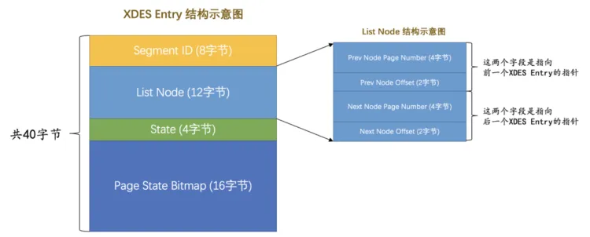

## 表空间
### 区
InnoDB 64个页成为1个区(extent)。  
每256个区成为1个组。

为什么引入区的概念，是因为数据量大了之后，为了让数据尽量顺序索引，而不是仅仅通过双向链表对页进行随机I/O，提高查询速度。

### 段
段也是为了提高顺序扫描的概率，需要把叶子节点和非叶子节点分开存储，放叶子节点的区的集合就算是一个`段`(segment)，存放非叶子节点的区的集合也算是一个`段`。也就是说一个索引会生成2个段，一个叶子节点段，一个非叶子节点段。


### 碎片区
在Mysql的段中，数据申请是按照区的来申请的，如果数据量特别小的话，如果按照区来申请，例如一个聚簇索引就两条数据，就需要两个区，2M的空间，这是一种浪费。  
为了节省空间，mysql提供了碎片区的概念，而是碎片区中的页可以用于不同的目的，比如有些页用于段A，有些页用于段B，有些页甚至哪个段都不属于。碎片区直属于表空间，并不属于任何一个段。

### 段分配策略
所以此后为某个段分配存储空间的策略是这样的：  
1. 在刚开始向表中插入数据的时候，段是从某个碎片区以单个页为单位来分配存储空间的。
2. 当某个段已经占用了32个碎片区页之后，就会以完整的区为单位来分配存储空间。

### 区的分类
分为4种类型：

1. 空闲的区：现在还没有用到这个区中的任何页。
2. 有剩余空间的碎片区：表示碎片区中还有可用的页。
3. 没有剩余空间的碎片区：表示碎片区中的所有页都被使用，没有空闲页。
4. 附属于某个段的区。每一个索引都可以分为叶子节点段和非叶子节点段，除此之外InnoDB还会另外定义一些特殊作用的段，在这些段中的数据量很大时将使用区来作为基本的分配单位。

这4种状态的区有特定的名词儿：

| **状态名** | **含义** |
| --- | --- |
| `FREE` | 空闲的区 |
| `FREE_FRAG` | 有剩余空间的碎片区 |
| `FULL_FRAG` | 没有剩余空间的碎片区 |
| `FSEG` | 附属于某个段的区 |

> 需要再次强调一遍的是，处于`FREE`、`FREE_FRAG`以及`FULL_FRAG`这三种状态的区都是独立的，算是直属于表空间；而处于`FSEG`状态的区是附属于某个段的。

### XDES
每一个区都对应着一个`XDES Entry(Extent Descriptor Entry)`结构，它为了方便管理这些区，这个结构记录了对应的区的一些属性。结构如下：



- `Segment ID`（8字节）  
每一个段都有一个唯一的编号，用ID表示，此处的`Segment ID`字段表示就是该区所在的段。当然前提是该区已经被分配给某个段了，不然的话该字段的值没什么意义。

- `List Node`（12字节）  
这个部分可以将若干个`XDES Entry`结构串联成一个链表。

- `State`（4字节）  
这个字段表明区的状态。可选的值就是我们前面说过的那4个，分别是：`FREE`、`FREE_FRAG`、`FULL_FRAG`和`FSEG`。具体释义就不多介绍了，前面说的够仔细了。  

- `Page State Bitmap`（16字节）  
这个部分共占用16个字节，也就是128个比特位。我们说一个区默认有64个页，这128个比特位被划分为64个部分，每个部分2个比特位，对应区中的一个页。比如`Page State Bitmap`部分的第1和第2个比特位对应着区中的第1个页，第3和第4个比特位对应着区中的第2个页，依此类推，`Page State Bitmap`部分的第127和128个比特位对应着区中的第64个页。这两个比特位的第一个位表示对应的页是否是空闲的，第二个比特位还没有用。


### XDES Entry链表
#### 1. 当段中数据较少的时候  
首先会查看表空间中是否有状态为`FREE_FRAG`的区，也就是找还有空闲空间的碎片区，如果找到了，那么从该区中取一些零碎的页把数据插进去；否则到表空间下申请一个状态为`FREE`的区，也就是空闲的区，把该区的状态变为`FREE_FRAG`，然后从该新申请的区中取一些零碎的页把数据插进去。之后不同的段使用零碎页的时候都会从该区中取，直到该区中没有空闲空间，然后该区的状态就变成了`FULL_FRAG`。
- 把状态为`FREE`的区对应的`XDES Entry`结构通过`List Node`来连接成一个链表，这个链表我们就称之为`FREE`链表。
- 把状态为`FREE_FRAG`的区对应的`XDES Entry`结构通过`List Node`来连接成一个链表，这个链表我们就称之为`FREE_FRAG`链表。
- 把状态为`FULL_FRAG`的区对应的`XDES Entry`结构通过`List Node`来连接成一个链表，这个链表我们就称之为`FULL_FRAG`链表。
> 想找一个`FREE_FRAG`状态的区时，就直接把`FREE_FRAG`链表的头节点拿出来，从这个节点中取一些零碎的页来插入数据，当这个节点对应的区用完时，就修改一下这个节点的`State`字段的值，然后从`FREE_FRAG`链表中移到`FULL_FRAG`链表中。同理，如果`FREE_FRAG`链表中一个节点都没有，那么就直接从`FREE`链表中取一个节点移动到`FREE_FRAG`链表的状态，并修改该节点的`STATE`字段值为`FREE_FRAG`，然后从这个节点对应的区中获取零碎的页就好了。


#### 2. 当段中数据已经占满了32个零散的页后
就直接申请完整的区来插入数据了。  
每个段中的区对应的`XDES Entry`结构建立了三个链表：
- `FREE`链表：同一个段中，所有页都是空闲的区对应的`XDES Entry`结构会被加入到这个链表。注意和直属于表空间的`FREE`链表区别开了，此处的`FREE`链表是附属于某个段的。
- `NOT_FULL`链表：同一个段中，仍有空闲空间的区对应的`XDES Entry`结构会被加入到这个链表。
- `FULL`链表：同一个段中，已经没有空闲空间的区对应的`XDES Entry`结构会被加入到这个链表。
> 每一个索引都对应两个段，每个段都会维护上述的3个链表。  
> 如果一个表共有两个索引，一个聚簇索引，一个二级索引，那么这个表共有4个段，  
> 每个段都会维护上述3个链表，总共是12个链表，加上我们上面说过的直属于表空间的3个链表，整个独立表空间共需要维护15个链表。

### 其他
段和区的具体结构后续再写。。。


## 单表访问的访问级别
### const
常数级的访问。  
主键或者唯一二级索引列与常数的等值比较来定位一条记录，把这种通过主键或者唯一二级索引列来定位一条记录的访问方法定义为：`const`，意思是常数级别的，代价是可以忽略不计的。
```sql
SELECT * FROM table_name WHERE id = x;
```

### ref
1. 对某个普通的二级索引列与常数进行等值比较。
```sql
SELECT * FROM table_name WHERE key1 = 'abc';
```

2. 不论是普通的二级索引，还是唯一二级索引，它们的索引列对包含`NULL`值的数量并不限制，所以我们采用`key IS NULL`这种形式的搜索条件最多只能使用`ref`的访问方法，而不是`const`的访问方法。
3. 对于某个包含多个索引列的二级索引来说，只要是最左边的连续索引列是与常数的等值比较就可能采用`ref`的访问方法。

### ref_or_null
找出某个二级索引列的值等于某个常数的记录和该列的值为`NULL`的记录。
```sql
SELECT * FROM table_name WHERE key1 = 'abc' OR key1 IS NULL;
```

### range
利用索引进行范围匹配。
```sql
SELECT * FROM table_name WHERE key2 IN (0, 1) OR (key2 >= 3 AND key2 <= 4);
```

### index
采用遍历二级索引记录的执行方式。
```sql
SELECT key_part1, key_part2, key_part3 FROM table_name WHERE key_part2 = 'x';
```

由于`key_part2`并不是联合索引`idx_key_part`最左索引列，所以我们无法使用`ref`或者`range`访问方法来执行这个语句。但是这个查询符合下面这两个条件：
1. 它的查询列表只有3个列：`key_part1`, `key_part2`, `key_part3`，而索引`idx_key_part`又包含这三个列。
2. 搜索条件中只有`key_part2`列。这个列也包含在索引`idx_key_part`中。  

可以直接通过遍历二级索引的叶子节点的记录来完成查询，而且这个过程也不用进行回表操作的情况，就是 index，直接遍历二级索引比直接遍历聚簇索引的成本要小很多。

### all
全表扫描，对于`InnoDB`表来说也就是直接扫描聚簇索引。


## 索引合并
### 交集合并
使用不同索引的搜索条件之间使用`AND`连接起来的情况；

### 并集合并
适用于使用不同索引的搜索条件之间使用`OR`连接起来的情况。

> 如果可能的话，建议使用联合索引替代Intersection索引合并


## 表连接
`连接`的本质就是把各个连接表中的记录都取出来依次匹配的组合加入结果集并返回给用户。

### 驱动表&被驱动表
多个表链接查询的时候，确定第一个需要查询的表，这个表称之为`驱动表`。针对驱动表的查询，和单表查询的方式是一样的，就是 const、ref、等等。

```sql
select * from table1 t1, table2 t2 where t1.id > 1 and t1.num > t2.num and t2.id > 2
```
这个查询语句中，t1 就是驱动表。  
拿到驱动表中复合条件的记录，再去t2中去查询复合条件的记录，t2就是被驱动表。

> 驱动表只需要访问一次，被驱动表根据从驱动表中取到的数据可能被访问多次。

### 内连接&外连接
对于`内连接`的两个表，驱动表中的记录在被驱动表中找不到匹配的记录，该记录不会加入到最后的结果集中。  
对于`外连接`的两个表，驱动表中的记录即使在被驱动表中没有匹配的记录，也仍然需要加入到结果集。

- 左外连接  
选取左侧的表为驱动表。

- 右外连接  
选取右侧的表为驱动表。

### 连接的原理
#### 嵌套循环连接（Nested-Loop Join）
1. 选取驱动表，使用与驱动表相关的过滤条件，选取代价最低的单表访问方法来执行对驱动表的单表查询。
2. 对上一步骤中查询驱动表得到的结果集中每一条记录，都分别到被驱动表中查找匹配的记录。

#### 使用索引加快连接速度

#### 基于块的嵌套循环连接（Block Nested-Loop Join）
> 尽量减少访问被驱动表的次数。  

把被驱动表的记录加载到内存的时候，一次性和多条驱动表中的记录做匹配，这样就可以大大减少重复从磁盘上加载被驱动表的代价了。  
`MySQL`有一个`join buffer`的概念，`join buffer`就是执行连接查询前申请的一块固定大小的内存，先把若干条驱动表结果集中的记录装在这个`join buffer`中，然后开始扫描被驱动表，每一条被驱动表的记录一次性和`join buffer`中的多条驱动表记录做匹配，因为匹配的过程都是在内存中完成的，所以这样可以显著减少被驱动表的`I/O`代价。

## MySQL基于成本的优化
### 基于成本的优化步骤
1. 根据搜索条件，找出所有可能使用的索引
2. 计算全表扫描的代价
3. 计算使用不同索引执行查询的代价
4. 对比各种执行方案的代价，找出成本最低的那一个。

### 基于索引统计数据的成本计算
先略

### 连接查询的成本
先略

## InnoDB统计数据是如何收集的
- `InnoDB`以表为单位来收集统计数据，这些统计数据可以是基于磁盘的永久性统计数据，也可以是基于内存的非永久性统计数据。
- `innodb_stats_persistent`控制着使用永久性统计数据还是非永久性统计数据；`innodb_stats_persistent_sample_pages`控制着永久性统计数据的采样页面数量；`innodb_stats_transient_sample_pages`控制着非永久性统计数据的采样页面数量；`innodb_stats_auto_recalc`控制着是否自动重新计算统计数据。
- 我们可以针对某个具体的表，在创建和修改表时通过指定`STATS_PERSISTENT`、`STATS_AUTO_RECALC`、`STATS_SAMPLE_PAGES`的值来控制相关统计数据属性。
- `innodb_stats_method`决定着在统计某个索引列不重复值的数量时如何对待`NULL`值。


## MySQL基于规则的优化
### 条件化简
我们编写的查询语句的搜索条件本质上是一个表达式，这些表达式可能比较繁杂，或者不能高效的执行，`MySQL`的查询优化器会为我们简化这些表达式。

1. 移除不必要的括号
```sql
((a = 5 AND b = c) OR ((a > c) AND (c < 5)))
(a = 5 and b = c) OR (a > c AND c < 5)
```

2. 常量传递（constant_propagation）
```sql
a = 5 AND b > a
a = 5 AND b > 5
```

3. 等值传递（equality_propagation）
```sql
a = b and b = c and c = 5
a = 5 and b = 5 and c = 5
```

4. 移除没用的条件（trivial_condition_removal）
```sql
(a < 1 and b = b) OR (a = 6 OR 5 != 5)
(a < 1 and TRUE) OR (a = 6 OR FALSE)
a < 1 OR a = 6
```

5. 表达式计算

```sql
a = 5 + 1
a = 6
```

### HAVING子句和WHERE子句的合并
如果查询语句中没有出现诸如`SUM`、`MAX`等等的聚集函数以及`GROUP BY`子句，优化器就把`HAVING`子句和`WHERE`子句合并起来。

### 常量表检测
查询的表中一条记录没有，或者只有一条记录。  
使用主键等值匹配或者唯一二级索引列等值匹配作为搜索条件来查询某个表。
> 优化器在分析一个查询语句时，先首先执行常量表查询，然后把查询中涉及到该表的条件全部替换成常数，最后再分析其余表的查询成本


### 外连接消除
外连接和内连接的本质区别就是：对于外连接的驱动表的记录来说，如果无法在被驱动表中找到匹配ON子句中的过滤条件的记录，那么该记录仍然会被加入到结果集中，对应的被驱动表记录的各个字段使用NULL值填充；而内连接的驱动表的记录如果无法在被驱动表中找到匹配ON子句中的过滤条件的记录，那么该记录会被舍弃.

在被驱动表的WHERE子句符合空值拒绝的条件后，外连接和内连接可以相互转换。这种转换带来的好处就是查询优化器可以通过评估表的不同连接顺序的成本，选出成本最低的那种连接顺序来执行查询。

### 子查询优化
后续再补充。。  

## 参考
[深入理解 Mysql 索引底层原理](https://zhuanlan.zhihu.com/p/113917726)  
[next-key锁定范围](https://segmentfault.com/a/1190000040129107)  
[索引之道](https://juejin.cn/post/7161964571853815822)  
[MySQL 是怎样运行的：从根儿上理解 MySQL](https://relph1119.github.io/mysql-learning-notes/#/)
[两万字详解InnoDB的锁](https://juejin.cn/post/7094049650428084232)