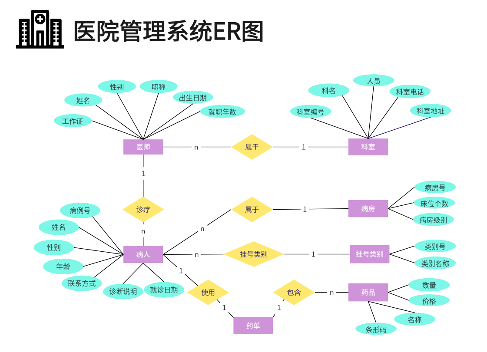

## SQL 练习
[leetcode](https://leetcode.cn/problemset/?topicSlugs=database&page=1&status=NOT_STARTED)
> leetcode 有 270+ 的SQL练习题, 从简到难刷一遍，觉得够够的。

## 常用的 SQL
### DDL(Data Defainition Language)
数据定义语言，主要是建表、改表、删表。

```sql
-- 创建表：
CREATE TABLE tab_name (
  id     		int         NOT NULL AUTO_INCREMENT COMMENT '主键',
  uid 			int         NOT NULL COMMENT '唯一流水id',
  name			varchar(20) NOT NULL DEFAULT '' COMMENT '名称',
  create_time	datetime    DEFAULT '1000-01-01 00:00:00' COMMENT '创建时间',
  update_time 	timestamp   default current_timestamp on update current_timestamp COMMENT '更新时间(会自动更新，不需要刻意程序更新)',
  PRIMARY KEY (id),
  UNIQUE KEY uniq_uid (uid),
  KEY idx_name (name)
) ENGINE=InnoDB DEFAULT CHARSET=utf8mb4 COMMENT='新建表注释';

-- 删表
DROP TABLE table_name;

-- 改表
-- 添加字符串型字段：
ALTER TABLE tab_name ADD col_name varchar(16) NOT NULL DEFAULT '' COMMENT '备注' AFTER  had_col_name;
-- 添加整型字段：
ALTER TABLE tab_name ADD col_name bigint  NOT NULL DEFAULT 0 COMMENT '备注' AFTER  had_col_name;
-- 添加加多个字段
ALTER TABLE tab_name 
	ADD col_1  varchar(10) NOT NULL DEFAULT '' COMMENT '备注' ,
	ADD col_2  varchar(20) NOT NULL DEFAULT '' COMMENT '备注' ;

-- 改字段类型
-- 主键由int(11)改为bigint(20)
ALTER TABLE tab_name MODIFY id bigint(20) NOT NULL AUTO_INCREASEMENT COMMENT '主键';
-- 单字段：
ALTER TABLE tab_name MODIFY COLUMN col_name bigint DEFAULT 0 COMMENT '备注';
-- 多字段：
ALTER TABLE tab_name MODIFY COLUMN col_name bigint DEFAULT 0 COMMENT '备注', MODIFY COLUMN col_name_1 bigint DEFAULT 0 COMMENT '备注';
-- 改字段备注
ALTER TABLE tab_name MODIFY COLUMN  col_name varchar(10) DEFAULT 0 COMMENT '改备注';
-- 改字段默认值
ALTER TABLE tab_name MODIFY COLUMN col_name bigint DEFAULT 100 COMMENT '备注';
-- 调整字段顺序
ALTER TABLE tab_name MODIFY COLUMN col_name bigint DEFAULT 100 COMMENT '备注' after other_col_name;
-- 改字段名称
ALTER TABLE tab_name CHANGE col_name new_col_name bigint DEFAULT 0 COMMENT '备注';
-- 加普通索引
ALTER TABLE tab_name ADD INDEX idx_col_col2 (col_name, col_name_1);
-- 加唯一索引
ALTER TABLE tab_name ADD UNIQUE uniq_name (col_name);
-- 改表备注
ALTER TABLE tab_name COMMENT='表备注';
-- 修改表自增值【必须比实际存储自增字段的最大值大】
ALTER TABLE tab_name auto_increment=xxx;
-- 改变表所有的字符列的字符集到一个新的字符集(示例为改为utf8mb4)
alter table tab_name convert to character set utf8mb4;

-- 删字段
-- 删一个字段
ALTER TABLE tab_name DROP COLUMN col_name;
-- 删多个字段
ALTER TABLE tab_name DROP COLUMN col_nam1, DROP COLUMN col_nam2;
-- 删除索引
ALTER TABLE tab_name DROP INDEX uniq_name;
```

### DML(Data manipulation Language)
数据库控制语言
```sql
-- insert
insert into table_name (col_name1, col_name2) values ('aa', 1),('bb', 2),('cc', 3);
-- insert update 
insert into table_name (col1, col2) values ('a', 1) on on duplicate key update col1 = values(col1), col2 = values(col2);

update table_name set col_name = 'aa' where id = xx;
delete table_name where id = xx;
```
### DQL(Date Query Language)
数据库查询语言
```sql
select a,b,c from table_name where id = xx;
group by 
having 
order by 
limit 1,1
```
> where 和 having 的区别
where 用于过滤，过滤后的数据才能参加聚合函数。即 where 在 group by 之前。
having 过滤分组，一般和 group by 配合使用，having 用来过滤分组后的数据。

### DCL(Data Control Language)
数据控制语句(dba 使用)
```sql
-- 分配权限给用户
grate 
-- 删除权限
revoke
```
> 运维用的多，开发用的少。

### drop、truncate、delete 区别
delete 删除数据会产生 binlog 日志，当然就可以恢复数据。  
drop 直接删除表。  
truncate 相当于删除表然后重建表，不产生数据日志。  

## 数据库的一些基础知识

### ER 图
ER 图（Entity-Relationship Diagram，实体-关系图）通过图形的方式描述了系统中数据实体及其之间的关系，ER 图通常用于数据库设计的早期阶段，帮助设计者和开发者理解系统中的数据结构和业务逻辑。

#### ER 图的基本概念  

实体（Entity）是现实世界中可以区分的事物，可以是一个物体、事件、地点或概念。在 ER 图中，实体用矩形框表示，框内写实体的名称。比如，`客户`、`产品`等。  

属性（Attribute）属性是实体的特征或性质，描述了实体的具体内容。在 ER 图中，属性用椭圆形表示，并与所属实体用线相连。比如，`客户`实体可能有 `姓名`、`地址`等属性。属性可以进一步分为简单属性（如姓名）、复合属性（如地址可以分为街道、城市等）、多值属性（如电话号码）和派生属性（如年龄可以从出生日期计算）。

关系（Relationship）表示实体之间的联系。在 ER 图中，关系用菱形表示，并与相关的实体用线相连。比如，`购买`关系连接`客户`和`产品`实体。

键（Key）是唯一标识实体或实体之间关系的属性。常见的键有主键（Primary Key），用来唯一标识一个实体实例；外键（Foreign Key），用来表示实体之间的关系。

#### ER 图的类型
- 一对一关系（1:1 Relationship）：一个实体实例与另一个实体实例之间存在唯一的对应关系。例如，一个人只有一个身份证，一个身份证只对应一个人。
- 一对多关系（1:N Relationship）：一个实体实例可以与多个其他实体实例关联，而这些其他实体实例只能与一个该实体实例关联。例如，一个部门可以有多个员工，而每个员工只能属于一个部门。
- 多对多关系（M:N Relationship）：一个实体实例可以与多个其他实体实例关联，反之亦然。例如，一个学生可以选修多门课程，而每门课程可以有多个学生选修。

#### ER 图的设计
1. 确定实体：识别出系统中的主要实体，并为每个实体命名。
2. 确定属性：为每个实体确定它的属性，包括主键和其他属性。
3. 确定关系：确定实体之间的关系类型，并为每个关系命名。
4. 绘制图形：使用图形工具或绘图软件绘制 ER 图，确保图形清晰易懂。

#### 示例

> 图源：https://boardmix.cn/article/drawerdiagram/

### 数据库三大范式
- 1NF 第一范式：属性（表中的字段）不可再分，确保每列的数据原子性；1NF 是所有关系型数据库的最基本要求，关系型数据库中创建的表一定要满足第一范式。
- 2NF 第二范式：在1NF基础上，确保表中的列都和主键相关，非主属性必须完全依赖于主键，主要意思是一个表中只能保存一种数据，不可以把多种数据保存在同一张数据库表中，例如主订单表，就只放主订单数据。商品相关放订单商品表或者叫自订单表中，如果都放在主订单表中，主订单表将会有很多重复的无意义的数据。  
- 3NF 第三范式：在2NF基础上，确保每列都和主键列直接相关，而不是间接相关，比如订单表不能存在用户信息，仅添加用户ID即可。  
>当然实际开发中也会用到反范式的情况，偶尔增加1、2个冗余字段，使得查询效率大大提高。或者数据库存储 JSON 串，甚至违反了 1NF。

### 存储过程
存储过程（Stored Procedure）是数据库系统中一种预编译的SQL代码块，旨在提高数据库操作的效率、简化应用程序开发、确保数据的一致性和安全性。  
它可以包含逻辑控制、流程控制、条件判断等功能，类似于编程语言中的函数。

存储过程是一个可以在数据库中保存并被反复调用的SQL代码块。它可以执行一系列的SQL语句，并且可以接收输入参数、返回输出参数或结果集。

#### 优点
1. 存储过程在创建时被预编译，执行效率较高，特别是在执行复杂查询或大量数据操作时，性能优势明显。
2. 存储过程在数据库服务器上执行，减少了客户端和服务器之间的数据传输，从而降低了网络负载。
3. 复杂的业务逻辑可以被封装在存储过程中，应用程序只需调用存储过程而不需要关心具体的实现细节。
4. 存储过程可以控制对数据库的访问权限，防止未经授权的用户直接操作数据库。
5.  通过存储过程可以确保在不同应用程序中对数据的操作逻辑保持一致，减少数据不一致的风险。

#### 缺点
1. 对于较复杂的业务逻辑，存储过程的编写和维护可能比较困难。
2. 存储过程通常依赖于特定的数据库管理系统（DBMS），不同DBMS之间的语法和功能可能不兼容，导致移植困难。
3. 存储过程在数据库中运行，缺乏像应用程序代码那样的调试工具，调试过程可能比较麻烦。

> 存储过程的使用要考虑实际场景。如果是 B 端的系统，例如 BI、数据分析、访问量不高，对耗时不敏感，其实是完全可以用存储过程的。  
> 但是对于大请求量的 C 端建议不要使用存储过程，因为存储过程难以调试和扩展，而且没有移植性，还会消耗数据库资源。