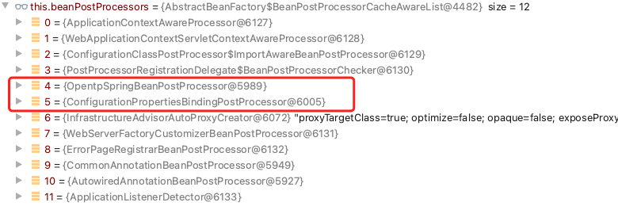
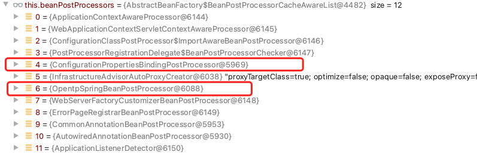

### 问题描述
我的开源项目 [opentp](https://github.com/zhanggongX/open-tp) 需要提供一个 spring-boot-starter 方便第三方使用 spring 框架集成 opentp-client。
但是写完发现属性加载不进来。  
代码如下：
```java
// opentp-client-spring-boot-starter 代码：
/**
 * 属性类
 */
@Component
@ConfigurationProperties(prefix = OpentpProperties.PREFIX)
public class OpentpProperties {

    public static final String PREFIX = "opentp";

    private String servers;
    private String name;

    public String getServers() {
        System.out.println("set servers");
        return servers;
    }

    public void setServers(String servers) {
        this.servers = servers;
    }

    public String getName() {
        return name;
    }

    public void setName(String name) {
        this.name = name;
    }
}

/**
 * 自动配置类
 */
@AutoConfiguration
@ConditionalOnBean(annotation = EnableOpentp.class)
@EnableConfigurationProperties(OpentpProperties.class)
public class OpentpAutoConfiguration implements InitializingBean {

    @Resource
    private OpentpProperties opentpProperties;

    @Override
    public void afterPropertiesSet() throws Exception {
        // 配置地址信息
        // 发现这里打断点，发现 OpentpProperties 对象的属性都是空的。
        List<InetSocketAddress> configInetSocketAddress = ServerAddressParser.parse(opentpProperties.getServers());
        cn.opentp.client.configuration.Configuration.configuration().serverAddresses().addAll(configInetSocketAddress);
    }

    @ConditionalOnMissingBean(OpentpClientBootstrap.class)
    @Bean
    public OpentpClientBootstrap opentpClientBootstrap() {
        return new OpentpClientBootstrap();
    }
}

// spring-boot-example 的配置文件，依赖项目 opentp-client-spring-boot-starter
opentp:
  servers: localhost:9527
  name: opentp-client1

```

经过各种debug，发现是我写的 BeanPostProcesser 导致的。

```java
// BeanPostProcessor 代码
// 该类主要是通过 postProcessAfterInitialization 扫描对象是否加了 @opentp 注解，  
// 如果是 ThreadPoolExecuter 且加了 @opentp，则创建 ThreadPoolContext 并缓存起来。
public class OpentpSpringBeanPostProcessor implements BeanPostProcessor, BeanFactoryAware, PriorityOrdered {

    private final static Logger log = LoggerFactory.getLogger(OpentpSpringBeanPostProcessor.class);

    private DefaultListableBeanFactory beanFactory;

    @Override
    public void setBeanFactory(BeanFactory beanFactory) throws BeansException {
        this.beanFactory = (DefaultListableBeanFactory) beanFactory;
    }

    @Override
    public int getOrder() {
        // 一开始是 return Ordered.HIGHEST_PRECEDENCE; 
        // 给了最高优先级，正是这里导致的属性配置失败。
//        return Ordered.HIGHEST_PRECEDENCE;
        return Ordered.LOWEST_PRECEDENCE;
    }

    /**
     * 在 spring bean 初始化回调
     * 如 InitializingBean 的 afterPropertiesSet 方法或者自定义的 init-method 之前被调用
     * 也就是说，这个方法会在bean的属性已经设置完毕，但还未进行初始化时被调用。
     *
     * @param bean     bean 对象
     * @param beanName bean name
     * @return bean
     * @throws BeansException 异常信息
     */
    @Override
    public Object postProcessBeforeInitialization(Object bean, String beanName) throws BeansException {
        // 这里是出问题的原因
        return null;
    }

    /**
     * 在 spring bean 初始化后回调
     * 比如 InitializingBean 的 afterPropertiesSet 或者自定义的初始化方法之后被调用
     * 这个时候，bean的属性值已经被填充完毕。返回的bean实例可能是原始bean的一个包装。
     *
     * @param bean     bean 对象
     * @param beanName bean name
     * @return bean
     * @throws BeansException 异常信息
     */
    @Override
    public Object postProcessAfterInitialization(Object bean, String beanName) throws BeansException {
        if (!(bean instanceof ThreadPoolExecutor)) {
            return bean;
        }

        Opentp opentp = beanFactory.findAnnotationOnBean(beanName, Opentp.class);
        if (opentp == null) {
            return bean;
        }

        log.debug("OpentpThreadPoolScan find @Opentp bean name: {}, annotation value: {}", beanName, opentp.value());

        ThreadPoolContext threadPoolContext = new ThreadPoolContext((ThreadPoolExecutor) bean);
        Configuration configuration = Configuration.configuration();
        Map<String, ThreadPoolContext> threadPoolContextCache = configuration.threadPoolContextCache();

        if (threadPoolContextCache.containsKey(opentp.value())) {
            throw new OpentpDupException();
        }

        threadPoolContextCache.put(opentp.value(), threadPoolContext);
        return bean;
    }
}
```

### 开始解决方案
BeanPostProcessor 中实现了 PriorityOrdered 并提供了优先级排序，  
我一开始给的是 Ordered.HIGHEST_PRECEDENCE;   
这样就导致了属性加载不进来，改成 Ordered.LOWEST_PRECEDENCE; 后就没问题了。  
这就很奇怪了，需要仔细研究下原因。

### 问题分析
@ConfigurationProperties 是 Springboot 用于配置文件中的指定键值对映射到一个java实体类上。那么它是怎么发挥作用的呢？  
主要是使用 properties 后置处理器 ConfigurationPropertiesBindingPostProcessor 这个bean后置处理器，他也是一个 BeanPostProcessor ，主要在 postProcessBeforeInitialization 方法中，对属性对象的值进行绑定。

Srping 容器 context 的 enviroment.propertySources 记录着系统属性、应用属性以及 Springboot 的默认配置文件 application.properties 中的配置属性等。  
ConfigurationPropertiesBindingPostProcessor 就是从其中找到匹配的配置项绑定到bean的属性上去的。
属性绑定是有覆盖性的，操作系统环境变量可以覆盖配置文件 application.properties, java 系统属性可以覆盖操作系统环境变量。

既然发现属性注入也是通过 BeanPostProcessor 实现的，那么就猜想出现问题大概率就是两个 BeanPostProcessor 之间出了什么问题导致的。
通过一通debug，发现 BeanPostProcessor 的调用最终是这两个方法在调用
```java
org.springframework.beans.factory.support.AbstractAutowireCapableBeanFactory#applyBeanPostProcessorsBeforeInitialization
org.springframework.beans.factory.support.AbstractAutowireCapableBeanFactory#applyBeanPostProcessorsAfterInitialization

@Override
	public Object applyBeanPostProcessorsBeforeInitialization(Object existingBean, String beanName)
			throws BeansException {

		Object result = existingBean;
        // 获得所有的 BeanPostProcessors 然后遍历执行 postProcessBeforeInitialization。
		for (BeanPostProcessor processor : getBeanPostProcessors()) {
			Object current = processor.postProcessBeforeInitialization(result, beanName);
			if (current == null) {
				return result;
			}
			result = current;
		}
		return result;
	}

	@Override
	public Object applyBeanPostProcessorsAfterInitialization(Object existingBean, String beanName)
			throws BeansException {

		Object result = existingBean;
        // 获得所有的 BeanPostProcessors 然后遍历执行 postProcessAfterInitialization
		for (BeanPostProcessor processor : getBeanPostProcessors()) {
			Object current = processor.postProcessAfterInitialization(result, beanName);
            // 
			if (current == null) {
				return result;
			}
			result = current;
		}
		return result;
	}
```

其中重点问题出现在 applyBeanPostProcessorsBeforeInitialization 中，代码详细分析
```java
// applyBeanPostProcessorsBeforeInitialization 中有个这样的循环

// getBeanPostProcessors 是获取所有的 BeanPostProcessors 列表
for (BeanPostProcessor processor : getBeanPostProcessors()) {
    // 调用具体的 BeanPostProcessors 的方法。
    Object current = processor.postProcessBeforeInitialization(result, beanName);
    // 如果 BeanPostProcessors 返回的是 null，则直接返回跳出循环。
    // 我自定义的 BeanPostProcessors 优先级设置的为 Ordered.LOWEST_PRECEDENCE; 优先级最高
    // 但是之前 postProcessBeforeInitialization 未添加任何逻辑，直接返回了 null 就导致这里跳出了循环
    // 而绑定配置的 ConfigurationPropertiesBindingPostProcessor 优先级是 Ordered.LOWEST_PRECEDENCE + 1
    // 而且 ConfigurationPropertiesBindingPostProcessor 是在 postProcessBeforeInitialization 中进行属性注入的
    // 所以这里执行跳出，就导致配置就空了。
    if (current == null) {
        return result;
    }
    result = current;
}
```

这是使用 PriorityOrdered 接口来排序，  
并且优先级设置为 Ordered.HIGHEST_PRECEDENCE 的 BeanPostProcessors 截图，  
刚好我自定义的 OpentpSpringBeanPostProcessor 在 ConfigurationPropertiesBindingPostProcessor 前。  



### 最终解决方案
在上述代码注释中已经说明了原因。  
1. 解决方案就是在自定义的 BeanPostProcessors 中一定要记得返回 Bean。  
2. 或者降低优先级（不是根本原因）。  
> 所以切记，无论 postProcessBeforeInitialization 和 postProcessAfterInitialization 中是否有逻辑，都要返回对象，不要返回 null。  


### 后续问题
后续我又发现不实现接口 PriorityOrdered 接口来排序，  
使用 @Order(Ordered.LOWEST_PRECEDENCE) 注解来排序也能解决 postProcessBeforeInitialization 返回 null 导致属性不能注入的问题。  
这是为啥？  

这是使用 @Order(Ordered.HIGHEST_PRECEDENCE) 来排序的 BeanPostProcessors 截图  



**和 图1 进行比较发现，自定义 OpentpSpringBeanPostProcessor 的位置不一样**。

又经过一通debug，发现原因出在 Springboot 注册 BeanPostProcessor 的地方。

```java
public static void registerBeanPostProcessors(
	ConfigurableListableBeanFactory beanFactory, AbstractApplicationContext applicationContext) {

        // 扫描到的所有 beanPostProcessor
		String[] postProcessorNames = beanFactory.getBeanNamesForType(BeanPostProcessor.class, true, false);

        // .... 删除了一些代码

        // 注册实现了 priorityOrdered 的 BeanPostProcessor
		sortPostProcessors(priorityOrderedPostProcessors, beanFactory);
		registerBeanPostProcessors(beanFactory, priorityOrderedPostProcessors);

        // .... 删除了一些代码

        // 注册 @ordered 注解的 BeanPostProcessor
		sortPostProcessors(orderedPostProcessors, beanFactory);
		registerBeanPostProcessors(beanFactory, orderedPostProcessors);

        // .... 删除了一些代码

        // 注册不排序的 BeanPostProcessor
		registerBeanPostProcessors(beanFactory, nonOrderedPostProcessors);

        // 注册 Springboot 内置的 BeanPostProcessor
		sortPostProcessors(internalPostProcessors, beanFactory);
		registerBeanPostProcessors(beanFactory, internalPostProcessors);

		beanFactory.addBeanPostProcessor(new ApplicationListenerDetector(applicationContext));
	}
```


所以 Springboot 内各种 BeanPostProcessor 不同排序方式之间是互相没关系的，他们之间也不进行排序。