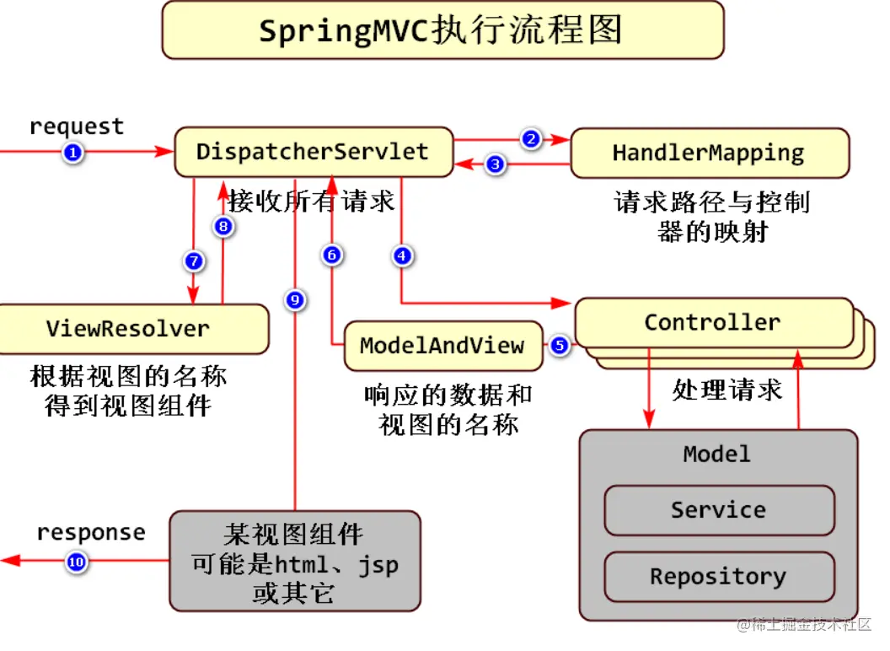

## SpringMVC 执行流程
主要介绍下 SpringMVC 接收到请求开始，到返回结果给浏览器的过程。

众所周知，SpringMVC 核心组件有：
1. 前端控制器 DispatcherServlet
所有的访问都会走到这个 Servlet 中，再根据配置进行中转到相应的 Handler 中进行处理，获取到数据和视图后，在使用相应视图做出响应。 
2. 处理器映射器 HandlerMapping
访问路径和对应的Handler存储为映射关系，在需要时供前端控制器查阅。 
3. 处理器适配器 HandlerAdapter
一个适配器，可以根据要求找到对应的 Handler 来运行。前端控制器通过处理器映射器找到对应的 Handler 信息之后，将请求响应和对应的 Handler 信息交由处理器适配器处理，处理器适配器找到真正 handler 执行后，将结果即 model 和 view 返回给前端控制器 
4. 视图解析器 ViewResolver
一种映射关系，可以将视图名称映射到真正的视图地址。前端控制器调用处理器适配完成后得到model和view，将view信息传给视图解析器得到真正的view。 
5. 视图渲染
将handler处理器中返回的 model 数据嵌入到视图解析器解析后得到前端页面，向客户端做出响应。

它们的执行流程如下：  

> 图源：https://juejin.cn/post/7088205512319172639

### 源码
所有的请求入口都在 `org.springframework.web.servlet.DispatcherServlet#doDispatch` 中，主要步骤我都标了序号。
```java
// org.springframework.web.servlet.DispatcherServlet

protected void doDispatch(HttpServletRequest request, HttpServletResponse response) throws Exception {
    HttpServletRequest processedRequest = request;
    HandlerExecutionChain mappedHandler = null;
    boolean multipartRequestParsed = false;

    WebAsyncManager asyncManager = WebAsyncUtils.getAsyncManager(request);

    try {
        // mv 结果
        ModelAndView mv = null;
        // 记录异常信息
        Exception dispatchException = null;

        try {
            // 文件上传相关
            processedRequest = checkMultipart(request);
            multipartRequestParsed = (processedRequest != request);

            // 1. 获得 HandlerExecutionChain mappedHandler
            mappedHandler = getHandler(processedRequest);
            if (mappedHandler == null) {
                // 如果没有找到处理器，调用noHandlerFound方法。
                noHandlerFound(processedRequest, response);
                return;
            }

            // 2. 获得 HandlerAdapter
            HandlerAdapter ha = getHandlerAdapter(mappedHandler.getHandler());

            // 如果是GET或HEAD请求，处理Last-Modified头。
            String method = request.getMethod();
            boolean isGet = HttpMethod.GET.matches(method);
            if (isGet || HttpMethod.HEAD.matches(method)) {
                long lastModified = ha.getLastModified(request, mappedHandler.getHandler());
                // 如果资源未修改，则返回304。
                if (new ServletWebRequest(request, response).checkNotModified(lastModified) && isGet) {
                    return;
                }
            }

            // 3. 调用拦截器的preHandle方法。
            if (!mappedHandler.applyPreHandle(processedRequest, response)) {
                return;
            }

            // 4. 调用处理器适配器的handle方法，实际执行处理器的逻辑。
            mv = ha.handle(processedRequest, response, mappedHandler.getHandler());

            if (asyncManager.isConcurrentHandlingStarted()) {
                // 如果已经开始异步处理，则直接返回。
                return;
            }

            // 如果没有设置视图名称，则应用默认视图名称。
            applyDefaultViewName(processedRequest, mv);
            // 5. 调用拦截器的postHandle方法。
            mappedHandler.applyPostHandle(processedRequest, response, mv);
        }
        catch (Exception ex) {
            // 捕获处理过程中的异常。
            dispatchException = ex;
        }
        catch (Throwable err) {
            // 捕获处理过程中的Error。
            dispatchException = new ServletException("Handler dispatch failed: " + err, err);
        }
        // ****** 处理执行结果，后续流程都在这个方法里。
        processDispatchResult(processedRequest, response, mappedHandler, mv, dispatchException);
    }
    catch (Exception ex) {
        // 触发afterCompletion方法。
        triggerAfterCompletion(processedRequest, response, mappedHandler, ex);
    }
    catch (Throwable err) {
        // 捕获触发afterCompletion过程中的任何Error。
        triggerAfterCompletion(processedRequest, response, mappedHandler,
                new ServletException("Handler processing failed: " + err, err));
    }
    finally {
        if (asyncManager.isConcurrentHandlingStarted()) {
            // 如果已经开始异步处理，调用HandlerExecutionChain的afterConcurrentHandlingStarted方法。
            if (mappedHandler != null) {
                mappedHandler.applyAfterConcurrentHandlingStarted(processedRequest, response);
            }
        }
        else {
            // 如果是多部分请求，清理资源。
            if (multipartRequestParsed) {
                cleanupMultipart(processedRequest);
            }
        }
    }
}

// 处理执行结果
private void processDispatchResult(HttpServletRequest request, HttpServletResponse response,
        @Nullable HandlerExecutionChain mappedHandler, @Nullable ModelAndView mv,
        @Nullable Exception exception) throws Exception {

    boolean errorView = false; // 标记是否渲染错误视图
    
    // 6. 如果存在异常，则执行异常处理逻辑，我们配的全局异常处理就在这里。
    if (exception != null) {
        // 如果存在异常，进行处理
        if (exception instanceof ModelAndViewDefiningException mavDefiningException) {
            // 如果异常是ModelAndViewDefiningException类型，它已经定义了ModelAndView
            logger.debug("ModelAndViewDefiningException encountered", exception);
            mv = mavDefiningException.getModelAndView();
        }
        else {
            // 否则，处理其他类型的异常
            Object handler = (mappedHandler != null ? mappedHandler.getHandler() : null);
            mv = processHandlerException(request, response, handler, exception);
            // 如果mv不为空，说明已经处理了异常并设置了错误视图
            errorView = (mv != null);
        }
    }

    // 检查处理器是否返回了要渲染的视图
    if (mv != null && !mv.wasCleared()) {
        // 7. 解析视图，8. 渲染视图
        render(mv, request, response);
        if (errorView) {
            // 如果渲染的是错误视图，则清除错误请求属性
            WebUtils.clearErrorRequestAttributes(request);
        }
    }
    else {
        // 如果ModelAndView为null或已被清除，则不进行视图渲染
        if (logger.isTraceEnabled()) {
            logger.trace("No view rendering, null ModelAndView returned.");
        }
    }

    if (WebAsyncUtils.getAsyncManager(request).isConcurrentHandlingStarted()) {
        // 如果已经开始了并发处理，则直接返回
        return;
    }

    if (mappedHandler != null) {
        // 9. 执行拦截器的 afterCompletion 方法。
        mappedHandler.triggerAfterCompletion(request, response, null);
    }
}

// 解析、渲染视图
protected void render(ModelAndView mv, HttpServletRequest request, HttpServletResponse response) throws Exception {
  // Determine locale for request and apply it to the response.
  Locale locale =
      (this.localeResolver != null ? this.localeResolver.resolveLocale(request) : request.getLocale());
  response.setLocale(locale);

  View view;
  String viewName = mv.getViewName();
  if (viewName != null) {
    // We need to resolve the view name.
    7. 解析视图
    view = resolveViewName(viewName, mv.getModelInternal(), locale, request);
    if (view == null) {
      throw new ServletException("Could not resolve view with name '" + mv.getViewName() +
          "' in servlet with name '" + getServletName() + "'");
    }
  }
  else {
    // No need to lookup: the ModelAndView object contains the actual View object.
    view = mv.getView();
    if (view == null) {
      throw new ServletException("ModelAndView [" + mv + "] neither contains a view name nor a " +
          "View object in servlet with name '" + getServletName() + "'");
    }
  }

  // Delegate to the View object for rendering.
  if (logger.isTraceEnabled()) {
    logger.trace("Rendering view [" + view + "] ");
  }
  try {
    if (mv.getStatus() != null) {
      request.setAttribute(View.RESPONSE_STATUS_ATTRIBUTE, mv.getStatus());
      response.setStatus(mv.getStatus().value());
    }
    // 8. 渲染视图。
    view.render(mv.getModelInternal(), request, response);
  }
  catch (Exception ex) {
    if (logger.isDebugEnabled()) {
      logger.debug("Error rendering view [" + view + "]", ex);
    }
    throw ex;
  }
}
```

### 总结
通过源码跟踪，SpringMVC 主要流程执行如下：
1. 获取 HandlerExecutionChain
2. 获取 HandlerAdapter
3. 执行拦截器的 preHandle 方法
4. 执行 HandlerAdapter (HandlerMethod)，真正去执行代码逻辑。
5. 执行拦截器的 postHandle 方法
6. 执行异常处理逻辑(全局异常处理器)
7. 解析视图(使用 response 对象响应数据)
8. 渲染视图
9. 执行拦截器的 afterCompletion