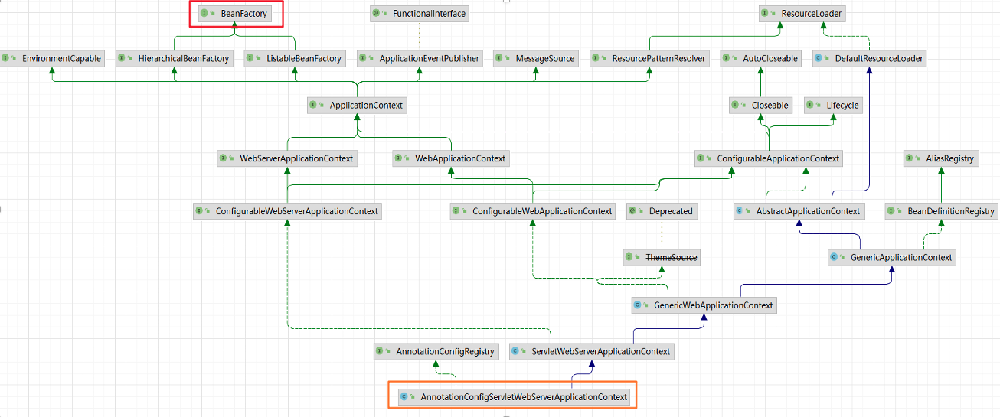

## 前置知识
主要介绍几个常用的 Springboot 扩展点和知识点，方便后续进行流程梳理。

- `ApplicationContextInitializer`
- `ApplicationListener` 
- `BeanFactory`
- `BeanDefinition`
- `BeanFactoryPostProcessor`
- `Aware`
- `InitializingBean/DisposableBean` 
- `BeanPostProcessor`。

### ApplicationContextInitializer
`ApplicationContextInitializer` 是在 IOC 容器对象创建完成后执行, 可以对上下文环境做一些操作，例如添加某些特定的 Bean、调整环境配置、运行环境属性注册等。
 

#### 使用
1. 实现方法：实现 `ApplicationContextInitializer` 接口，并覆盖 `initialize` 方法。
```java
import org.springframework.context.ApplicationContextInitializer;
import org.springframework.context.ConfigurableApplicationContext;

public class MyContextInitializer implements ApplicationContextInitializer<ConfigurableApplicationContext> {
    @Override
    public void initialize(ConfigurableApplicationContext applicationContext) {
        System.out.println("Initializing application context");
        // 可以在这里对 applicationContext 进行配置
        ConfigurableEnvironment env = applicationContext.getEnvironment();
        MutableProperySources sou = env.getPropertySources();

        Map<String, Object> selfDefineProperty = new HashMap<>();
        selfDefineProperty.put("applicationName", "springboot-text");

        sou.addFirst(new MapPropertySource("TEST_MAP", selfDefineProperty));
    }
}
```

2. 注册进容器：可以通过 `spring.factories` 或者 `.imports` 文件或编程方式注册。

```properties
# 在 src/main/resources/META-INF/spring.factories 中添加
org.springframework.context.ApplicationContextInitializer=the.package.MyContextInitializer
```

### ApplicationListener
`ApplicationListener` 是事件监听器接口，用于监听 `ApplicationEvent` 及其子类事件，允许程序执行自己的代码，完成事件驱动开发，可以监听容器初始化完成、初始化失败等事件。
通常情况下可以使用监听器加载资，开启定时任务等。


#### 使用
1. 实现 `ApplicationListener` 接口，并覆盖 `onApplicationEvent` 方法。

```java
import org.springframework.context.ApplicationListener;
import org.springframework.context.event.ContextRefreshedEvent;

@Configuration
public class MyApplicationListener implements ApplicationListener<ContextRefreshedEvent> {
    @Override
    public void onApplicationEvent(ContextRefreshedEvent event) {
        System.out.println("Application context refreshed");
    }
}
```
2. 注册进容器：可以通过 `@Component` 注解自动扫描注册，也可以通过 `applicationContext.addApplicationListener` 方法手动注册，当然也可以通过 `spring.factories` 或者 `.imports` 文件。


### BeanFactory
`BeanFactory` 是 Spring 的核心接口之一，它是 Bean 容器的根接口, 提供 Bean 对象的创建、配置、依赖注入等功能。
而我们常用来 getBean 的 SpringContext，其内部还是调用了 BeanFactory 的接口。



#### 使用
- 实例化和获取 Bean：通过 `getBean` 方法可以获取 Bean 的实例。

```java
public <T> T getBean(String name, Class<T> requiredType) throws BeansException {
    this.assertBeanFactoryActive();
    // 获取到 DefaultListableBeanFactory
    return this.getBeanFactory().getBean(name, requiredType);
}
```
> 懒加载，只有在首次请求 Bean 时才会创建实例。

### BeanDefinition
`BeanDefinition` 是描述 Bean 属性的接口。包括 Bean 的名称，Bean 的属性，Bean 的行为，实现的接口，添加的注解等等，Spring 中，Bean 在创建之前，都需要封装成对应的 BeanDefinition，然后根据 BeanDefinition 进一步创建 Bean 对象。


> 通过 @Bean 注解注入的对象，使用 ConfigurationClassBeanDefinition 类，通过其他注解输入的对象，使用 ScannedGenricBeanDefinition。

### BeanFactoryPostProcessor
`BeanFactoryPostProcessor` Bean工厂后置处理器是在 `BeanFactory` 创建后但在 Bean 实例化前，对 Bean 的定义（`BeanDefinition`）进行修改的接口，通过调用该接口的 postProcessBeanFactory 方法，经常用于新增 BeanDefinition。

#### 使用
实现 `BeanFactoryPostProcessor` 接口，并覆盖 `postProcessBeanFactory` 方法。

```java
import org.springframework.beans.factory.config.BeanFactoryPostProcessor;
import org.springframework.beans.factory.config.ConfigurableListableBeanFactory;

public class MyBeanFactoryPostProcessor implements BeanFactoryPostProcessor {
    @Override
    public void postProcessBeanFactory(ConfigurableListableBeanFactory beanFactory) {
        System.out.println("Post-processing bean factory");
        // 可以在这里对 BeanDefinition 进行修改，或者新增 BeanDefinition。
        DefaultListableBeanFactory factory = (DefaultListableBeanFactory) beanFactory();
        BeanDefinitionBuilder builder = BeanDefinitionBuilder.genericBeanDefinition(MyBean.class);
        builder.addPropertyValue("property1", "value1");
        factory.registerBeanDefinition("myBean", builder.getBeanDefinition());
    }
}
```
> 可以通过 `@Component` 注解自动扫描注册。

#### Springboot 的 BeanFactoryPosProcessor
- ConfigurationClassPostProcesser: 用来扫描启动类所在包下的注解。
- ServletComponentRegisteringPostProcessor 扫描 @WebServlet、@WebFilter、@WebListener 注解
- CachingMetadataReaderFactoryPostProcessor 配置ConfigurationClassPostProcessor
- ConfigurationWarningsPostProcessor  配置警告提示


### Aware 接口
`Aware` 是一个标记接口，Spring 容器通过它来感知 Bean 的一些特性，并注入相应的资源，Spring 会判断当前的 Bean 有没有实现 Aware 接口，如果实现了，会在特定的时机回调接口对应的方法。

#### 常见 Aware 接口

- `BeanNameAware`：感知 Bean 的名称。
- `BeanFactoryAware`：感知当前 BeanFactory。
- `ApplicationContextAware`：感知当前 ApplicationContext。

#### 使用
实现方法：实现相应的 Aware 接口，并覆盖相应的设置方法。

```java
import org.springframework.beans.factory.BeanNameAware;
import org.springframework.context.ApplicationContextAware;
import org.springframework.context.ApplicationContext;

public class MyAwareBean implements BeanNameAware, ApplicationContextAware {
    @Override
    public void setBeanName(String name) {
        System.out.println("Bean name is: " + name);
    }

    @Override
    public void setApplicationContext(ApplicationContext applicationContext) {
        System.out.println("Application context set");
    }
}
```

### InitializingBean/DisposableBean

#### InitializingBean
`InitializingBean` 是一个回调接口，定义了在 Bean 属性设置完毕后需要执行的方法，当 Bean 被实例化好后，会回调里面的函数，经常用于做一些加载资源的工作。

实现 `InitializingBean` 接口，并覆盖 `afterPropertiesSet` 方法。

```java
import org.springframework.beans.factory.InitializingBean;

public class MyInitializingBean implements InitializingBean {
    @Override
    public void afterPropertiesSet() throws Exception {
        System.out.println("Bean properties set");
    }
}
```

#### DisposableBean

`DisposableBean` 是一个回调接口，定义了在 Bean 销毁时需要执行的方法，当Bean被销毁之前，会回调里面的函数，经常用于做一些释放资源的工作。

实现 `DisposableBean` 接口，并覆盖 `destroy` 方法。

```java
import org.springframework.beans.factory.DisposableBean;

public class MyDisposableBean implements DisposableBean {
    @Override
    public void destroy() throws Exception {
        System.out.println("Bean destroyed");
    }
}
```

### BeanPostProcessor
`BeanPostProcessor` Bean 的后置处理器，是在 Bean 初始化前后进行自定义处理的接口。它提供了两个回调方法，分别在 Bean 初始化前和初始化后执行。

实现 `BeanPostProcessor` 接口，并覆盖 `postProcessBeforeInitialization` 和 `postProcessAfterInitialization` 方法。

```java
import org.springframework.beans.factory.config.BeanPostProcessor;

public class MyBeanPostProcessor implements BeanPostProcessor {
    @Override
    public Object postProcessBeforeInitialization(Object bean, String beanName) {
        System.out.println("Before Initialization: " + beanName);
        return bean;
    }

    @Override
    public Object postProcessAfterInitialization(Object bean, String beanName) {
        System.out.println("After Initialization: " + beanName);
        return bean;
    }
}
```

> 可以通过 `@Component` 注解自动扫描注册。

### 结论

这些接口和类在 Spring Boot 中扮演了重要角色，它们共同协作实现了灵活且强大的依赖注入机制。通过理解和合理使用这些工具，可以更好地控制和优化应用的生命周期管理。