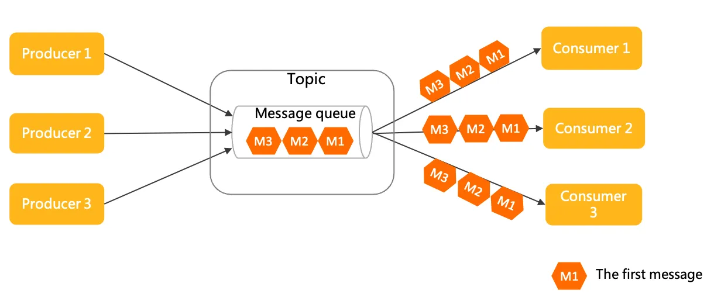

## RocketMQ 基本概念
1. 主题（Topic）  
RocketMQ 中消息传输和存储的顶层容器，用于标识同一类业务逻辑的消息。主题通过TopicName 来做唯一标识和区分。
2. 消息类型（MessageType）  
RocketMQ 中按照消息传输特性的不同而定义的分类，用于类型管理和安全校验。RocketMQ 支持的消息类型有普通消息、顺序消息、事务消息和定时/延时消息。
> RocketMQ 从 5.0 版本开始，支持强制校验消息类型，即每个主题 Topic 只允许发送一种消息类型的消息，这样可以更好的运维和管理生产系统，避免混乱。但同时保证向下兼容 4.x 版本行为，强制校验功能默认开启。

3. 消息队列（MessageQueue）  
队列是 RocketMQ 中消息存储和传输的实际容器，也是消息的最小存储单元。  
RocketMQ 的所有主题都是由多个队列组成，以此实现队列数量的水平拆分和队列内部的流式存储。队列通过 QueueId 来做唯一标识和区分。

4. 消息（Message）  
消息是 RocketMQ 中的最小数据传输单元。生产者将业务数据的负载和拓展属性包装成消息发送到服务端，服务端按照相关语义将消息投递到消费端进行消费。

5. 消息视图（MessageView）  
消息视图是 RocketMQ 面向开发视角提供的一种消息只读接口。通过消息视图可以读取消息内部的多个属性和负载信息，但是不能对消息本身做任何修改。

6. 消息标签（MessageTag）  
消息标签是 RocketMQ 提供的细粒度消息分类属性，可以在主题层级之下做消息类型的细分。消费者通过订阅特定的标签来实现细粒度过滤。

7. 消息位点（MessageQueueOffset）  
消息是按到达 RocketMQ 服务端的先后顺序存储在指定主题的多个队列中，每条消息在队列中都有一个唯一的Long类型坐标，这个坐标被定义为消息位点。用来进行消费进度管理。
 
8. 消费位点（ConsumerOffset）  
一条消息被某个消费者消费完成后不会立即从队列中删除， RocketMQ 会基于每个消费者分组记录消费过的最新一条消息的位点，即消费位点。用来进行消费进度管理。

9. 消息索引（MessageKey）  
消息索引是 RocketMQ 提供的面向消息的索引属性。通过设置的消息索引可以快速查找到对应的消息内容。

10. 生产者（Producer）  
生产者是 RocketMQ 系统中用来构建并传输消息到服务端的运行实体。生产者通常被集成在业务系统中，将业务消息按照要求封装成消息并发送至服务端。

11. 事务检查器（TransactionChecker）  
RocketMQ 中生产者用来执行本地事务检查和异常事务恢复的监听器。事务检查器应该通过业务侧数据的状态来检查和判断事务消息的状态。主要用来实现事务消息

12. 事务状态（TransactionResolution）  
RocketMQ 中事务消息发送过程中，事务提交的状态标识，服务端通过事务状态控制事务消息是否应该提交和投递。事务状态包括事务提交、事务回滚和事务未决。

13. 消费者分组（ConsumerGroup）  
消费者分组是 RocketMQ 系统中承载多个消费行为一致的消费者的负载均衡分组。和消费者不同，消费者分组并不是运行实体，而是一个逻辑资源。在  RocketMQ 中，通过消费者分组内初始化多个消费者实现消费性能的水平扩展以及高可用容灾。

14. 消费者（Consumer）  
消费者是 RocketMQ 中用来接收并处理消息的运行实体。消费者通常被集成在业务系统中，从服务端获取消息，并将消息转化成业务可理解的信息，供业务逻辑处理。

15. 消费结果（ConsumeResult）  
RocketMQ 中PushConsumer消费监听器处理消息完成后返回的处理结果，用来标识本次消息是否正确处理。消费结果包含消费成功和消费失败。

16. 订阅关系（Subscription）  
订阅关系是 RocketMQ 系统中消费者获取消息、处理消息的规则和状态配置。订阅关系由消费者分组动态注册到服务端系统，并在后续的消息传输中按照订阅关系定义的过滤规则进行消息匹配和消费进度维护。

17. 消息过滤  
消费者可以通过订阅指定消息标签（Tag）对消息进行过滤，确保最终只接收被过滤后的消息合集。过滤规则的计算和匹配在 RocketMQ 的服务端完成。

18. 重置消费位点  
以时间轴为坐标，在消息持久化存储的时间范围内，重新设置消费者分组对已订阅主题的消费进度，设置完成后消费者将接收设定时间点之后，由生产者发送到 RocketMQ 服务端的消息。

19. 消息轨迹  
在一条消息从生产者发出到消费者接收并处理过程中，由各个相关节点的时间、地点等数据汇聚而成的完整链路信息。通过消息轨迹，您能清晰定位消息从生产者发出，经由 RocketMQ 服务端，投递给消费者的完整链路，方便定位排查问题。

20. 消息堆积  
生产者已经将消息发送到 RocketMQ 的服务端，但由于消费者的消费能力有限，未能在短时间内将所有消息正确消费掉，此时在服务端保存着未被消费的消息，该状态即消息堆积。

21. 事务消息  
事务消息是 RocketMQ 提供的一种高级消息类型，支持在分布式场景下保障消息生产和本地事务的最终一致性。

22. 定时/延时消息  
定时/延时消息是 RocketMQ 提供的一种高级消息类型，消息被发送至服务端后，在指定时间后才能被消费者消费。通过设置一定的定时时间可以实现分布式场景的延时调度触发效果。

23. 顺序消息  
顺序消息是 RocketMQ 提供的一种高级消息类型，支持消费者按照发送消息的先后顺序获取消息，从而实现业务场景中的顺序处理。

## RocketMQ 部署
参考官方文档：  
[Docker 部署 RocketMQ | RocketMQ](https://rocketmq.apache.org/zh/docs/quickStart/02quickstartWithDocker)

## RocketMQ 领域模型
RocketMQ 是一款典型的分布式架构下的中间件产品，使用异步通信方式和发布订阅的消息传输模型。   
RocketMQ 中消息的生命周期主要分为消息生产、消息存储、消息消费这三部分。  

生产者生产消息并发送至 RocketMQ 服务端，消息被存储在服务端的主题中，消费者通过订阅主题消费消息。  


### 生产者（Producer）
Apache RocketMQ 中用于产生消息的运行实体，一般集成于业务调用链路的上游。生产者是轻量级匿名无身份的。

### 消息存储
- 主题（Topic）  
RocketMQ 消息传输和存储的分组容器，主题内部由多个队列组成，消息的存储和水平扩展实际是通过主题内的队列实现的。

- 队列（MessageQueue）  
RocketMQ 消息传输和存储的实际单元容器，类比于其他消息队列中的分区。 RocketMQ 通过流式特性的无限队列结构来存储消息，消息在队列内具备顺序性存储特征。

- 消息（Message）  
Apache RocketMQ 的最小传输单元。消息具备不可变性，在初始化发送和完成存储后即不可变。

- 消息消费
    - 消费者分组（ConsumerGroup）  
    RocketMQ 发布订阅模型中定义的独立的消费身份分组，用于统一管理底层运行的多个消费者（Consumer）。同一个消费组的多个消费者必须保持消费逻辑和配置一致，共同分担该消费组订阅的消息，实现消费能力的水平扩展。
    - 消费者（Consumer）  
    RocketMQ 消费消息的运行实体，一般集成在业务调用链路的下游。消费者必须被指定到某一个消费组中。

- 订阅关系（Subscription）
RocketMQ 发布订阅模型中消息过滤、重试、消费进度的规则配置。订阅关系以消费组粒度进行管理，消费组通过定义订阅关系控制指定消费组下的消费者如何实现消息过滤、消费重试及消费进度恢复等。

> RocketMQ 的订阅关系除过滤表达式之外都是持久化的，即服务端重启或请求断开，订阅关系依然保留。

### 通信方式
相比较同步调用的 RPC 通信方式，使用消息中间件，各子系统之间无需强耦合直接连接，调用方只需要将请求转化成异步事件（消息）发送给中间代理，发送成功即可认为该异步链路调用完成，剩下的工作中间代理会负责将事件可靠通知到下游的调用系统，确保任务执行完成。该中间代理一般就是消息中间件。

异步通信的优势如下：

+ 系统拓扑简单。由于调用方和被调用方统一和中间代理通信，系统是星型结构，易于维护和管理。
+ 上下游耦合性弱。上下游系统之间弱耦合，结构更灵活，由中间代理负责缓冲和异步恢复。 上下游系统间可以独立升级和变更，不会互相影响。
+ 容量削峰填谷。基于消息的中间代理往往具备很强的流量缓冲和整形能力，业务流量高峰到来时不会击垮下游。

### 消息传输模型



RocketMQ 使用的是发布订阅模型，发布订阅模型具有如下特点：

+ 消费独立：相比队列模型的匿名消费方式，发布订阅模型中消费方都会具备的身份，一般叫做订阅组（订阅关系），不同订阅组之间相互独立不会相互影响。
+ 一对多通信：基于独立身份的设计，同一个主题内的消息可以被多个订阅组处理，每个订阅组都可以拿到全量消息。因此发布订阅模型可以实现一对多通信。

> 点对点模型和发布订阅模型各有优势，点对点模型更为简单，但是实现广播就比较复杂。而发布订阅模型的扩展性更高。 RocketMQ 使用的传输模型为发布订阅模型，因此也具有发布订阅模型的特点。

## 主题
主题是 RocketMQ 中消息传输和存储的顶层容器，用于标识同一类业务逻辑的消息。 主题的作用主要如下：
+ 定义数据的分类隔离： 在 RocketMQ 的方案设计中，建议将不同业务类型的数据拆分到不同的主题中管理，通过主题实现存储的隔离性和订阅隔离性。
+ 定义数据的身份和权限： RocketMQ 的消息本身是匿名无身份的，同一分类的消息使用相同的主题来做身份识别和权限管理。

### 注意事项：
1. 消息类型必须一致：发送的消息的类型，必须和目标主题定义的消息类型一致。
2. 主题类型必须单一：每个主题只支持一种消息类型，不允许将多种类型的消息发送到同一个主题中。
> 主题 message_type 支持 Normal、FIFO、Delay、Transaction。默认为 Normal。

3. 按照业务分类合理拆分主题
    - 消息类型是否一致：不同类型的消息，如顺序消息和普通消息需要使用不同的主题。
    - 消息业务是否关联：如果业务没有直接关联，建议拆分到多个主题中。
    - 消息量级是否一样：数量级不同或时效性不同的业务消息建议使用不同的主题。
    - 拆分粒度过粗：会导致业务隔离性差，不利于独立运维和故障处理。
    - 拆分粒度过细：会消耗大量主题资源，造成系统负载过重。
4. 主题管理尽量避免自动化机制  
生产环境需要严格管理主题资源，请勿随意进行增、删、改、查操作。  
RocketMQ 虽然提供了自动创建主题的功能，但是建议仅在测试环境使用，生产环境请勿打开，避免产生大量垃圾主题，无法管理和回收并浪费系统资源。


## 队列
队列是 RocketMQ 中消息存储和传输的实际容器，也是 RocketMQ 消息的最小存储单元。RocketMQ 的所有主题都是由多个队列组成，以此实现队列数量的水平拆分和队列内部的流式存储。

队列的主要作用如下：  
+ 存储顺序性  
队列天然具备顺序性，即消息按照进入队列的顺序写入存储，消息在队列中的位置和消息之间的顺序通过位点（Offset）进行标记管理。

+ 流式操作语义  
RocketMQ 基于队列的存储模型可确保消息从任意位点读取任意数量的消息，以此实现类似聚合读取、回溯读取等特性，这些特性是RabbitMQ、ActiveMQ等非队列存储模型不具备的。

### 注意事项：
1. 按照实际业务消耗设置队列数  
RocketMQ 的队列数可在创建主题或变更主题时设置修改，队列数量的设置应遵循少用够用原则，避免随意增加队列数量。

> 主题内队列数过多可能对导致如下问题：  
> 1. 集群元数据膨胀  
RocketMQ 会以队列粒度采集指标和监控数据，队列过多容易造成管控元数据膨胀。
> 2. 客户端压力过大  
RocketMQ 的消息读写都是针对队列进行操作，队列过多对应更多的轮询请求，增加系统负荷。

2. 常见队列增加场景
    - 需要增加队列实现物理节点负载均衡  
    RocketMQ 每个主题的多个队列可以分布在不同的服务节点上，在集群水平扩容增加节点后，为了保证集群流量的负载均衡，建议在新的服务节点上新增队列，或将旧的队列迁移到新的服务节点上。

    - 需要增加队列实现顺序消息性能扩展  
    在 RocketMQ 服务端4.x版本中，顺序消息的顺序性在队列内生效的，因此顺序消息的并发度会在一定程度上受队列数量的影响，因此建议仅在系统性能瓶颈时再增加队列。

## 消息
消息是 RocketMQ 中的最小数据传输单元。生产者将业务数据的负载和拓展属性包装成消息发送到 RocketMQ 服务端，服务端按照相关语义将消息投递到消费端进行消费。  

Apache RocketMQ 的消息模型具备如下特点：
+ 消息不可变性
+ 消息持久化
> 消息类型参考主题类型。


### 消息内部属性
1. 主题名称  
当前消息所属的主题的名称。集群内全局唯一。
2. 消息类型  
当前消息的类型。
3. 消息队列  
实际存储当前消息的队列。更多信息，由服务端指定并填充。
4. 消息位点  
当前消息存储在队列中的位置，由服务端指定并填充。取值范围：0 ~ long.Max。
5. 消息ID  
消息的唯一标识，集群内每条消息的ID全局唯一，生产者客户端系统自动生成。固定为数字和大写字母组成的32位字符串。
6. 索引Key列表（可选）  
消息的索引键，可通过设置不同的Key区分消息和快速查找消息，由生产者客户端定义。
7. 过滤标签Tag（可选）  
消息的过滤标签。消费者可通过Tag对消息进行过滤，仅接收指定标签的消息。，由生产者客户端定义，一条消息仅支持设置一个标签。
8. 定时时间（可选）  
定时场景下，消息触发延时投递的毫秒级时间戳，由消息生产者定义，最大可设置定时时长为40天。
9. 消息发送时间  
消息发送时，生产者客户端系统的本地毫秒级时间戳，由生产者客户端系统填充，消息发送时间是以客户端系统时钟为准。
10. 消息保存时间戳  
消息在 RocketMQ 服务端完成存储时，服务端系统的本地毫秒级时间戳。 对于定时消息和事务消息，消息保存时间指的是消息生效对消费方可见的服务端系统时间，由服务端系统填充，消息保留时间是以服务端系统时钟为准。
11. 消费重试次数  
消息消费失败后，RocketMQ 服务端重新投递的次数，每次重试，重试次数加1，由服务端系统标记。
12. 业务自定义属性  
生产者可以自定义设置的扩展信息，由消息生产者自定义，按照字符串键值对设置。
13. 消息负载
业务消息的实际报文数据，由生产者负责序列化编码，按照二进制字节传输。

> 系统默认的消息最大限制如下：  
> 普通和顺序消息：4 MB。  
> 事务和定时或延时消息：64 KB。

> 单条消息不建议传输超大负载，如果单条消息过大容易造成网络传输层压力，不利于异常重试和流量控制。

> 消息中转时做好不可变设计

> RocketMQ 服务端5.x版本中，消息本身不可编辑，消费端获取的消息都是只读消息视图。  
> 但在历史版本3.x和4.x版本中消息不可变性没有强约束，因此如果您需要在使用过程中对消息进行中转操作，务必将消息重新初始化。

```java
// 正确的用法
Message m = Consumer.receive();
Message m2= MessageBuilder.buildFrom(m);
Producer.send(m2);
// 错误的用法
Message m = Consumer.receive();
m.update()；
Producer.send(m);
```

### 普通消息


```java
//普通消息发送。
MessageBuilder messageBuilder = new MessageBuilderImpl();
Message message = messageBuilder.setTopic("topic")
    //设置消息索引键，可根据关键字精确查找某条消息。
    .setKeys("messageKey")
    //设置消息Tag，用于消费端根据指定Tag过滤消息。
    .setTag("messageTag")
    //消息体。
    .setBody("messageBody".getBytes())
    .build();
try {
    //发送消息，需要关注发送结果，并捕获失败等异常。
    SendReceipt sendReceipt = producer.send(message);
    System.out.println(sendReceipt.getMessageId());
} catch (ClientException e) {
    e.printStackTrace();
}
//消费示例一：使用PushConsumer消费普通消息，只需要在消费监听器中处理即可。
MessageListener messageListener = new MessageListener() {
    @Override
    public ConsumeResult consume(MessageView messageView) {
        System.out.println(messageView);
        //根据消费结果返回状态。
        return ConsumeResult.SUCCESS;
    }
};
//消费示例二：使用SimpleConsumer消费普通消息，主动获取消息进行消费处理并提交消费结果。
List<MessageView> messageViewList = null;
try {
    messageViewList = simpleConsumer.receive(10, Duration.ofSeconds(30));
    messageViewList.forEach(messageView -> {
        System.out.println(messageView);
        //消费处理完成后，需要主动调用ACK提交消费结果。
        try {
            simpleConsumer.ack(messageView);
        } catch (ClientException e) {
            e.printStackTrace();
        }
    });
} catch (ClientException e) {
    //如果遇到系统流控等原因造成拉取失败，需要重新发起获取消息请求。
    e.printStackTrace();
}
```

### 定时/延时消息
例如：订单下单后暂未支付，此时不可以直接关闭订单，而是需要等待一段时间后才能关闭订单。

RocketMQ 定时消息设置的定时时间是一个预期触发的系统时间戳，延时时间也需要转换成当前系统时间后的某一个时间戳，而不是一段延时时长。定时时长最大值默认为24小时。定时消息仅支持在 MessageType为 Delay 的主题内使用。


```java
//定时/延时消息发送
MessageBuilder messageBuilder = new MessageBuilderImpl();;
//以下示例表示：延迟时间为10分钟之后的Unix时间戳。
Long deliverTimeStamp = System.currentTimeMillis() + 10L * 60 * 1000;
Message message = messageBuilder.setTopic("topic")
        //设置消息索引键，可根据关键字精确查找某条消息。
        .setKeys("messageKey")
        //设置消息Tag，用于消费端根据指定Tag过滤消息。
        .setTag("messageTag")
        .setDeliveryTimestamp(deliverTimeStamp)
        //消息体
        .setBody("messageBody".getBytes())
        .build();
try {
    //发送消息，需要关注发送结果，并捕获失败等异常。
    SendReceipt sendReceipt = producer.send(message);
    System.out.println(sendReceipt.getMessageId());
} catch (ClientException e) {
    e.printStackTrace();
}
//消费示例一：使用PushConsumer消费定时消息，只需要在消费监听器处理即可。
MessageListener messageListener = new MessageListener() {
    @Override
    public ConsumeResult consume(MessageView messageView) {
        System.out.println(messageView.getDeliveryTimestamp());
        //根据消费结果返回状态。
        return ConsumeResult.SUCCESS;
    }
};
//消费示例二：使用SimpleConsumer消费定时消息，主动获取消息进行消费处理并提交消费结果。
List<MessageView> messageViewList = null;
try {
    messageViewList = simpleConsumer.receive(10, Duration.ofSeconds(30));
    messageViewList.forEach(messageView -> {
        System.out.println(messageView);
        //消费处理完成后，需要主动调用ACK提交消费结果。
        try {
            simpleConsumer.ack(messageView);
        } catch (ClientException e) {
            e.printStackTrace();
        }
    });
} catch (ClientException e) {
    //如果遇到系统流控等原因造成拉取失败，需要重新发起获取消息请求。
    e.printStackTrace();
}
```

### 顺序消息
使用场景：  
1. 以证券、股票交易撮合场景为例，对于出价相同的交易单，坚持按照先出价先交易的原则，下游处理订单的系统需要严格按照出价顺序来处理订单。
2. 以数据库变更增量同步场景为例，上游源端数据库按需执行增删改操作，将二进制操作日志作为消息，通过 RocketMQ 传输到下游搜索系统，下游系统按顺序还原消息数据，实现状态数据按序刷新。

#### 顺序性保证：
1. 生产顺序性 ：
    - 单一生产者：消息生产的顺序性仅支持单一生产者，不同生产者分布在不同的系统，即使设置相同的消息组，不同生产者之间产生的消息也无法判定其先后顺序。
    - 串行发送：RocketMQ 生产者客户端支持多线程安全访问，但如果生产者使用多线程并行发送，则不同线程间产生的消息将无法判定其先后顺序。
2. 存储顺序性：
    - 相同消息组的消息按照先后顺序被存储在同一个队列。
    - 不同消息组的消息可以混合在同一个队列中，但不保证连续。
3. 消费顺序性：
    - RocketMQ 通过消费者和服务端的协议保障消息消费严格按照存储的先后顺序来处理。

> 如需保证消息消费的顺序性，则必须满足以下条件：
>1. 投递顺序   
> RocketMQ 通过客户端SDK和服务端通信协议保障消息按照服务端存储顺序投递，但业务方消费消息时需要严格按照接收---处理---应答的语义处理消息，避免因异步处理导致消息乱序。  
> 消费者类型为PushConsumer时， Apache RocketMQ 保证消息按照存储顺序一条一条投递给消费者，若消费者类型为SimpleConsumer，则消费者有可能一次拉取多条消息。此时，消息消费的顺序性需要由业务方自行保证。   
>2. 有限重试   
> Apache RocketMQ 顺序消息投递仅在重试次数限定范围内，即一条消息如果一直重试失败，超过最大重试次数后将不再重试，跳过这条消息消费，不会一直阻塞后续消息处理。    


```java
//顺序消息发送。
MessageBuilder messageBuilder = new MessageBuilderImpl();;
Message message = messageBuilder.setTopic("topic")
        //设置消息索引键，可根据关键字精确查找某条消息。
        .setKeys("messageKey")
        //设置消息Tag，用于消费端根据指定Tag过滤消息。
        .setTag("messageTag")
        //设置顺序消息的排序分组，该分组尽量保持离散，避免热点排序分组。
        .setMessageGroup("fifoGroup001")
        //消息体。
        .setBody("messageBody".getBytes())
        .build();
try {
    //发送消息，需要关注发送结果，并捕获失败等异常
    SendReceipt sendReceipt = producer.send(message);
    System.out.println(sendReceipt.getMessageId());
} catch (ClientException e) {
    e.printStackTrace();
}
//消费顺序消息时，需要确保当前消费者分组是顺序投递模式，否则仍然按并发乱序投递。
//消费示例一：使用PushConsumer消费顺序消息，只需要在消费监听器处理即可。
MessageListener messageListener = new MessageListener() {
    @Override
    public ConsumeResult consume(MessageView messageView) {
        System.out.println(messageView);
        //根据消费结果返回状态。
        return ConsumeResult.SUCCESS;
    }
};
//消费示例二：使用SimpleConsumer消费顺序消息，主动获取消息进行消费处理并提交消费结果。
//需要注意的是，同一个MessageGroup的消息，如果前序消息没有消费完成，再次调用Receive是获取不到后续消息的。
List<MessageView> messageViewList = null;
try {
    messageViewList = simpleConsumer.receive(10, Duration.ofSeconds(30));
    messageViewList.forEach(messageView -> {
        System.out.println(messageView);
        //消费处理完成后，需要主动调用ACK提交消费结果。
        try {
            simpleConsumer.ack(messageView);
        } catch (ClientException e) {
            e.printStackTrace();
        }
    });
} catch (ClientException e) {
    //如果遇到系统流控等原因造成拉取失败，需要重新发起获取消息请求。
    e.printStackTrace();
}
```

#### 使用建议：
1. 串行消费，避免批量消费导致乱序
2. 消息组尽可能打散，避免集中导致热点，RocketMQ 保证相同消息组的消息存储在同一个队列中，如果不同业务场景的消息都集中在少量或一个消息组中，则这些消息存储压力都会集中到服务端的少量队列或一个队列中。

### 事务消息


```java
//演示demo，模拟订单表查询服务，用来确认订单事务是否提交成功。
private static boolean checkOrderById(String orderId) {
    return true;
}
//演示demo，模拟本地事务的执行结果。
private static boolean doLocalTransaction() {
    return true;
}
public static void main(String[] args) throws ClientException {
    ClientServiceProvider provider = new ClientServiceProvider();
    MessageBuilder messageBuilder = new MessageBuilderImpl();
    //构造事务生产者：事务消息需要生产者构建一个事务检查器，用于检查确认异常半事务的中间状态。
    Producer producer = provider.newProducerBuilder()
            .setTransactionChecker(messageView -> {
                /**
                 * 事务检查器一般是根据业务的ID去检查本地事务是否正确提交还是回滚，此处以订单ID属性为例。
                 * 在订单表找到了这个订单，说明本地事务插入订单的操作已经正确提交；如果订单表没有订单，说明本地事务已经回滚。
                 */
                final String orderId = messageView.getProperties().get("OrderId");
                if (Strings.isNullOrEmpty(orderId)) {
                    // 错误的消息，直接返回Rollback。
                    return TransactionResolution.ROLLBACK;
                }
                return checkOrderById(orderId) ? TransactionResolution.COMMIT : TransactionResolution.ROLLBACK;
            })
            .build();
    //开启事务分支。
    final Transaction transaction;
    try {
        transaction = producer.beginTransaction();
    } catch (ClientException e) {
        e.printStackTrace();
        //事务分支开启失败，直接退出。
        return;
    }
    Message message = messageBuilder.setTopic("topic")
            //设置消息索引键，可根据关键字精确查找某条消息。
            .setKeys("messageKey")
            //设置消息Tag，用于消费端根据指定Tag过滤消息。
            .setTag("messageTag")
            //一般事务消息都会设置一个本地事务关联的唯一ID，用来做本地事务回查的校验。
            .addProperty("OrderId", "xxx")
            //消息体。
            .setBody("messageBody".getBytes())
            .build();
    //发送半事务消息
    final SendReceipt sendReceipt;
    try {
        sendReceipt = producer.send(message, transaction);
    } catch (ClientException e) {
        //半事务消息发送失败，事务可以直接退出并回滚。
        return;
    }
    /**
     * 执行本地事务，并确定本地事务结果。
     * 1. 如果本地事务提交成功，则提交消息事务。
     * 2. 如果本地事务提交失败，则回滚消息事务。
     * 3. 如果本地事务未知异常，则不处理，等待事务消息回查。
     *
     */
    boolean localTransactionOk = doLocalTransaction();
    if (localTransactionOk) {
        try {
            transaction.commit();
        } catch (ClientException e) {
            // 业务可以自身对实时性的要求选择是否重试，如果放弃重试，可以依赖事务消息回查机制进行事务状态的提交。
            e.printStackTrace();
        }
    } else {
        try {
            transaction.rollback();
        } catch (ClientException e) {
            // 建议记录异常信息，回滚异常时可以无需重试，依赖事务消息回查机制进行事务状态的提交。
            e.printStackTrace();
        }
    }
}
```

#### 使用建议
1. 避免大量未决事务导致超时  
RocketMQ 支持在事务提交阶段异常的情况下发起事务回查，保证事务一致性。但生产者应该尽量避免本地事务返回未知结果。大量的事务检查会导致系统性能受损，容易导致事务处理延迟。

2. 正确处理"进行中"的事务  
消息回查时，对于正在进行中的事务不要返回Rollback或Commit结果，应继续保持Unknown的状态。 一般出现消息回查时事务正在处理的原因为：事务执行较慢，消息回查太快。解决方案：1. 将第一次事务回查时间设置较大一些，但可能导致依赖回查的事务提交延迟较大，2. 程序能正确识别正在进行中的事务。

### 消息的重试
RocketMQ 客户端连接服务端发起消息发送请求时，可能会因为网络故障、服务异常等原因导致调用失败。为保证消息的可靠性， RocketMQ 在客户端 SDK 中内置请求重试逻辑，尝试通过重试发送达到最终调用成功的效果。

#### 重试流程
生产者在初始化时设置消息发送最大重试次数，当出现触发条件的场景时，生产者客户端会按照设置的重试次数一直重试发送消息，直到消息发送成功或达到最大重试次数重试结束，并在最后一次重试失败后返回调用错误响应。
+ 同步发送：调用线程会一直阻塞，直到某次重试成功或最终重试失败，抛出错误码和异常。
+ 异步发送：调用线程不会阻塞，但调用结果会通过异常事件或者成功事件返回。

#### 重试间隔
除服务端返回系统流控错误场景，其他触发条件触发重试后，均会立即进行重试，无等待间隔。  
若由于服务端返回流控错误触发重试，系统会按照指数退避策略进行延迟重试。指数退避算法通过以下参数控制重试行为。
- INITIAL_BACKOFF： 第一次失败重试前后需等待多久，默认值：1秒。
- MULTIPLIER ：指数退避因子，即退避倍率，默认值：1.6。
- JITTER ：随机抖动因子，默认值：0.2。
- MAX_BACKOFF ：等待间隔时间上限，默认值：120秒
- MIN_CONNECT_TIMEOUT ：最短重试间隔，默认值：20秒。

```java
ConnectWithBackoff()
current_backoff = INITIAL_BACKOFF
current_deadline = now() + INITIAL_BACKOFF
while (TryConnect(Max(current_deadline, now() + MIN_CONNECT_TIMEOUT))!= SUCCESS)
SleepUntil(current_deadline)
current_backoff = Min(current_backoff * MULTIPLIER, MAX_BACKOFF)
current_deadline = now() + current_backoff + UniformRandom(-JITTER * current_backoff, JITTER * current_backoff)
```

#### 重试带来的问题：
+ 链路耗时阻塞：从重试机制可以看出，在重试流程中生产者仅能控制最大重试次数。若由于系统异常触发了SDK内置的重试逻辑，则服务端需要等待最终重试结果，可能会导致消息发送请求链路被阻塞。
+ 最终异常兜底： RocketMQ 客户端内置的发送请求重试机制并不能保证消息发送一定成功。当最终重试仍然失败时，做好冗余保护处理，避免消息发送结果不一致。
+ 消息重复问题：因远程调用的不确定性，当 RocketMQ 客户端因请求超时触发消息发送重试流程，此时客户端无法感知服务端的处理结果，客户端进行的消息发送重试可能会产生消息重复问题，业务逻辑需要自行处理消息重复问题。

### 消息流控机制
消息流控指的是系统容量或水位过高， RocketMQ 服务端会通过快速失败返回流控错误来避免底层资源承受过高压力。

触发条件  
+ 存储压力大：参考消费进度管理的原理机制，消费者分组的初始消费位点为当前队列的最大消费位点。若某些场景例如业务上新等需要回溯到指定时刻前开始消费，此时队列的存储压力会瞬间飙升，触发消息流控。  
+ 服务端请求任务排队溢出：消费者消费能力不足，导致队列中有大量堆积消息，当堆积消息超过一定数量后会触发消息流控，减少下游消费系统压力。

#### 流控行为
当系统触发消息发送流控时，客户端会收到系统限流错误和异常，错误码信息如下：
+ reply-code：530
+ reply-text：TOO_MANY_REQUESTS

客户端收到系统流控错误码后，会根据指数退避策略进行消息发送重试。

#### 处理建议
+ 如何避免触发消息流控：触发限流的根本原因是系统容量或水位过高，可以利用可观测性功能监控系统水位容量等，保证底层资源充足，避免触发流控机制。
+ 突发消息流控处理：如果因为突发原因触发消息流控，且客户端内置的重试流程执行失败，则建议业务方将请求调用临时替换到其他系统进行应急处理。

## 生产者
### 属性
1. 客户端ID，生产者客户端的标识，用于区分不同的生产者。集群内全局唯一，由 RocketMQ 自动生成，主要用于日志查看、问题定位等运维场景，不支持修改。
2. 通信参数，连接服务端的接入地址，用于识别服务端集群，接入点必须按格式配置，建议使用域名，避免使用IP地址，防止节点变更无法进行热点迁移。身份认证信息 （可选）， 仅在服务端开启身份识别和认证时需要传输。请求超时时间 （可选），客户端网络请求调用的超时时间。
3. 预绑定主题列表，RocketMQ 的生产者需要将消息发送到的目标主题列表，主要作用如下：
    - 事务消息 （必须设置） ：事务消息场景下，生产者在故障、重启恢复时，需要检查事务消息的主题中是否有未提交的事务消息。避免生产者发送新消息后，主题中的旧事务消息一直处于未提交状态，造成业务延迟。
    - 非事务消息 （建议设置） ：服务端会在生产者初始化时根据预绑定主题列表，检查目标主题的访问权限和合法性，而不需要等到应用启动后再检查。
4. 事务检查器，RocketMQ 的事务消息机制中，为保证异常场景下事务的最终一致性，生产者需要主动实现事务检查器的接口。发送事务消息时，事务检查器必须设置，且需要和预绑定主题列表一起配合使用。
5. 发送重试策略：生产者在消息发送失败时的重试策略。

### 使用建议
不建议单一进程创建大量生产者。  
不建议频繁创建和销毁生产者。  

## 消费分组
消费者分组是 RocketMQ 系统中承载多个消费行为一致的消费者的负载均衡分组。它并不是运行实体，而是一个逻辑资源。

## 消费者
消费者是  RocketMQ 中用来接收并处理消息的运行实体。

### 消费者分类
RocketMQ 支持 PushConsumer 、 SimpleConsumer 以及 PullConsumer 这三种类型的消费者。

| 对比项 | PushConsumer | SimpleConsumer | PullConsumer |
| --- | --- | --- | --- |
| 接口方式 | 使用监听器回调接口返回消费结果，消费者仅允许在监听器范围内处理消费逻辑。 | 业务方自行实现消息处理，并主动调用接口返回消费结果。 | 业务方自行按队列拉取消息，并可选择性地提交消费结果 |
| 消费并发度管理 | 由SDK管理消费并发度。 | 由业务方消费逻辑自行管理消费线程。 | 由业务方消费逻辑自行管理消费线程。 |
| 负载均衡粒度 | 5.0 SDK是消息粒度，更均衡，早期版本是队列维度 | 消息粒度，更均衡 | 队列粒度，吞吐攒批性能更好，但容易不均衡 |
| 接口灵活度 | 高度封装，不够灵活。 | 原子接口，可灵活自定义。 | 原子接口，可灵活自定义。 |
| 适用场景 | 适用于无自定义流程的业务消息开发场景。 | 适用于需要高度自定义业务流程的业务开发场景。 | 仅推荐在流处理框架场景下集成使用 |


### PushConsumer
PushConsumers 是一种高度封装的消费者类型，消费消息仅通过消费监听器处理业务并返回消费结果。消息的获取、消费状态提交以及消费重试都通过 RocketMQ 的客户端SDK完成，在消费者初始化时注册一个消费监听器，并在消费监听器内部实现消息处理逻辑。

```java
// 消费示例：使用PushConsumer消费普通消息。
ClientServiceProvider provider = ClientServiceProvider.loadService();
String topic = "YourTopic";
FilterExpression filterExpression = new FilterExpression("YourFilterTag", FilterExpressionType.TAG);
PushConsumer pushConsumer = provider.newPushConsumerBuilder()
    // 设置消费者分组。
    .setConsumerGroup("YourConsumerGroup")
    // 设置接入点。
    .setClientConfiguration(ClientConfiguration.newBuilder().setEndpoints("YourEndpoint").build())
    // 设置预绑定的订阅关系。
    .setSubscriptionExpressions(Collections.singletonMap(topic, filterExpression))
    // 设置消费监听器。
    .setMessageListener(new MessageListener() {
        @Override
        public ConsumeResult consume(MessageView messageView) {
            // 消费消息并返回处理结果。
            return ConsumeResult.SUCCESS;
        }
    })
    .build();
```

#### 原理
在PushConsumer类型中，消息的实时处理能力是基于 SDK 内部的典型 Reactor 线程模型实现的。如下图所示，SDK 内置了一个长轮询线程，先将消息异步拉取到 SDK 内置的缓存队列中，再分别提交到消费线程中，触发监听器执行本地消费逻辑。

#### 适用场景
PushConsumer严格限制了消息同步处理及每条消息的处理超时时间，适用于以下场景：
+ 消息处理时间可预估：如果不确定消息处理耗时，经常有预期之外的长时间耗时的消息，PushConsumer的可靠性保证会频繁触发消息重试机制造成大量重复消息。
+ 无异步化、高级定制场景：PushConsumer限制了消费逻辑的线程模型，由客户端SDK内部按最大吞吐量触发消息处理。该模型开发逻辑简单，但是不允许使用异步化和自定义处理流程。

### SimpleConsumer
SimpleConsumer 是一种接口原子型的消费者类型，消息的获取、消费状态提交以及消费重试都是通过消费者业务逻辑主动发起调用完成。

```java
// 消费示例：使用 SimpleConsumer 消费普通消息，主动获取消息处理并提交。 
ClientServiceProvider provider = ClientServiceProvider.loadService();
String topic = "YourTopic";
FilterExpression filterExpression = new FilterExpression("YourFilterTag", FilterExpressionType.TAG);
SimpleConsumer simpleConsumer = provider.newSimpleConsumerBuilder()
        // 设置消费者分组。
        .setConsumerGroup("YourConsumerGroup")
        // 设置接入点。
        .setClientConfiguration(ClientConfiguration.newBuilder().setEndpoints("YourEndpoint").build())
        // 设置预绑定的订阅关系。
        .setSubscriptionExpressions(Collections.singletonMap(topic, filterExpression))
        // 设置从服务端接受消息的最大等待时间
        .setAwaitDuration(Duration.ofSeconds(1))
        .build();
try {
    // SimpleConsumer 需要主动获取消息，并处理。
    List<MessageView> messageViewList = simpleConsumer.receive(10, Duration.ofSeconds(30));
    messageViewList.forEach(messageView -> {
        System.out.println(messageView);
        // 消费处理完成后，需要主动调用 ACK 提交消费结果。
        try {
            simpleConsumer.ack(messageView);
        } catch (ClientException e) {
            logger.error("Failed to ack message, messageId={}", messageView.getMessageId(), e);
        }
    });
} catch (ClientException e) {
    // 如果遇到系统流控等原因造成拉取失败，需要重新发起获取消息请求。
    logger.error("Failed to receive message", e);
}
```

#### 适用场景
SimpleConsumer适用于以下场景：
+ 消息处理时长不可控：如果消息处理时长无法预估，经常有长时间耗时的消息处理情况。建议使用SimpleConsumer消费类型，可以在消费时自定义消息的预估处理时长，若实际业务中预估的消息处理时长不符合预期，也可以通过接口提前修改。
+ 需要异步化、批量消费等高级定制场景：SimpleConsumer在SDK内部没有复杂的线程封装，完全由业务逻辑自由定制，可以实现异步分发、批量消费等高级定制场景。
+ 需要自定义消费速率：SimpleConsumer是由业务逻辑主动调用接口获取消息，因此可以自由调整获取消息的频率，自定义控制消费速率。

### PullConsumer
待补充

### 消息过滤
RocketMQ 的消息过滤功能，可以帮助消费者更高效地过滤自己需要的消息集合，避免大量无效消息投递给消费者，降低下游系统处理压力。

RocketMQ 支持Tag标签过滤和SQL属性过滤，这两种过滤方式对比如下：

| 对比项 | Tag标签过滤 | SQL属性过滤 |
| --- | --- | --- |
| 过滤目标 | 消息的Tag标签。 | 消息的属性，包括用户自定义属性以及系统属性（Tag是一种系统属性）。 |
| 过滤能力 | 精准匹配。 | SQL语法匹配。 |
| 适用场景 | 简单过滤场景、计算逻辑简单轻量。 | 复杂过滤场景、计算逻辑较复杂。 |

#### Tag标签设置
+ Tag由生产者发送消息时设置，每条消息允许设置一个Tag标签。
+ Tag使用可见字符，建议长度不超过128字符。

#### Tag标签过滤规则
Tag标签过滤为精准字符串匹配，过滤规则设置格式如下：

+ 单Tag匹配：过滤表达式为目标Tag。表示只有消息标签为指定目标Tag的消息符合匹配条件，会被发送给消费者。
+ 多Tag匹配：多个Tag之间为或的关系，不同Tag间使用两个竖线（||）隔开。例如，Tag1||Tag2||Tag3，表示标签为Tag1或Tag2或Tag3的消息都满足匹配条件，都会被发送给消费者进行消费。
+ 全部匹配：使用星号（*）作为全匹配表达式。表示主题下的所有消息都将被发送给消费者进行消费。

```java
Message message = messageBuilder.setTopic("topic")
//设置消息索引键，可根据关键字精确查找某条消息。
.setKeys("messageKey")
//设置消息Tag，用于消费端根据指定Tag过滤消息。
//该示例表示消息的Tag设置为"TagA"。
.setTag("TagA")
//消息体。
.setBody("messageBody".getBytes())
.build();

String topic = "Your Topic";
//只订阅消息标签为"TagA"、"TagB"或"TagC"的消息。
FilterExpression filterExpression = new FilterExpression("TagA||TagB||TagC", FilterExpressionType.TAG);
pushConsumer.subscribe(topic, filterExpression);
```

#### SQL 过滤
SQL属性过滤使用SQL92语法作为过滤规则表达式，语法规范如下：

| 语法 | 说明 | 示例 |
| --- | --- | --- |
| IS NULL | 判断属性不存在。 | `a IS NULL`<br/> ：属性a不存在。 |
| IS NOT NULL | 判断属性存在。 | `a IS NOT NULL`<br/>：属性a存在。 |
| _>__ _>= _<__ _<= | 用于比较数字，不能用于比较字符串，否则消费者客户端启动时会报错。 **说明** 可转化为数字的字符串也被认为是数字。 | `_a IS NOT NULL AND a > 100_`<br/>_：属性a存在且属性a的值大于100。__ _`a IS NOT NULL AND a > 'abc'`<br/>：错误示例，abc为字符串，不能用于比较大小。 |
| BETWEEN xxx AND xxx | 用于比较数字，不能用于比较字符串，否则消费者客户端启动时会报错。等价于>= xxx AND \<= xxx。表示属性值在两个数字之间。 | `a IS NOT NULL AND (a BETWEEN 10 AND 100)`<br/>：属性a存在且属性a的值大于等于10且小于等于100。 |
| NOT BETWEEN xxx AND xxx | 用于比较数字，不能用于比较字符串，否则消费者客户端启动会报错。等价于\< xxx OR > xxx，表示属性值在两个值的区间之外。 | `a IS NOT NULL AND (a NOT BETWEEN 10 AND 100)`<br/>：属性a存在且属性a的值小于10或大于100。 |
| IN (xxx, xxx) | 表示属性的值在某个集合内。集合的元素只能是字符串。 | `a IS NOT NULL AND (a IN ('abc', 'def'))`<br/>：属性a存在且属性a的值为abc或def。 |
| _=__ _<> | 等于和不等于。可用于比较数字和字符串。 | `a IS NOT NULL AND (a = 'abc' OR a<>'def')`<br/>：属性a存在且属性a的值为abc或a的值不为def。 |
| _AND__ _OR | 逻辑与、逻辑或。可用于组合任意简单的逻辑判断，需要将每个逻辑判断内容放入括号内。 | `a IS NOT NULL AND (a > 100) OR (b IS NULL)`<br/>：属性a存在且属性a的值大于100或属性b不存在。 |


```java
Message message = messageBuilder.setTopic("topic")
//设置消息索引键，可根据关键字精确查找某条消息。
.setKeys("messageKey")
//设置消息Tag，用于消费端根据指定Tag过滤消息。
//该示例表示消息的Tag设置为"messageTag"。
.setTag("messageTag")
//消息也可以设置自定义的分类属性，例如环境标签、地域、逻辑分支。
//该示例表示为消息自定义一个属性，该属性为地域，属性值为杭州。
.addProperty("Region", "Hangzhou")
//消息体。
.setBody("messageBody".getBytes())
.build();

String topic = "topic";
//只订阅地域属性为杭州的消息。
FilterExpression filterExpression = new FilterExpression("Region IS NOT NULL AND Region='Hangzhou'", FilterExpressionType.SQL92);
simpleConsumer.subscribe(topic, filterExpression);
```

### 广播消费和共享消费
在 Apache RocketMQ 领域模型中，同一条消息支持被多个消费者分组订阅，同时，对于每个消费者分组可以初始化多个消费者。可以根据消费者分组和消费者的不同组合，实现以下两种不同的消费效果：


+ **消费组间广播消费** ：如上图所示，每个消费者分组只初始化唯一一个消费者，每个消费者可消费到消费者分组内所有的消息，各消费者分组都订阅相同的消息，以此实现单客户端级别的广播一对多推送效果。
> 该方式一般可用于网关推送、配置推送等场景。

+ **消费组内共享消费** ：如上图所示，每个消费者分组下初始化了多个消费者，这些消费者共同分担消费者分组内的所有消息，实现消费者分组内流量的水平拆分和均衡负载。
> 该方式一般可用于微服务解耦场景。

### 消费负载均衡
消费组内共享消费场景下，消费者分组内多个消费者共同分担消息，消息按照哪种逻辑分配给哪个消费者，就是由消费者负载均衡策略所决定的。

根据消费者类型的不同，消费者负载均衡策略分为以下两种模式：

+ 消息粒度负载均衡：PushConsumer和SimpleConsumer默认负载策略。

消息粒度负载均衡策略保证同一个队列的消息可以被多个消费者共同处理，但是该策略使用的消息分配算法结果是随机的，并不能指定消息被哪一个特定的消费者处理，消费者获取某条消息后，服务端会将该消息加锁，保证这条消息对其他消费者不可见，直到该消息消费成功或消费超时。因此，即使多个消费者同时消费同一队列的消息，服务端也可保证消息不会被多个消费者重复消费。  
顺序消息中，消息粒度负载均衡策略保证同一消息组内的消息，按照服务端存储的先后顺序进行消费。不同消费者处理同一个消息组内的消息时，会严格按照先后顺序锁定消息状态，确保同一消息组的消息串行消费，即前边消费的消息不提交，其他的消息无法被消费。

> 消息粒度负载均衡策略不需要额外设置，对于PushConsumer和SimpleConsumer消费者类型默认启用。


+ 队列粒度负载均衡：PullConsumer默认负载策略。

队列粒度负载均衡策略中，同一消费者分组内的多个消费者将按照队列粒度消费消息，即每个队列仅被一个消费者消费。  
队列粒度的负载均衡，基于队列数量、消费者数量等运行数据进行统一的算法分配，将每个队列绑定到特定的消费者，然后每个消费者按照取消息>提交消费位点>持久化消费位点的消费语义处理消息，取消息过程不提交消费状态，因此，为了避免消息被多个消费者重复消费，每个队列仅支持被一个消费者消费。

> 无论是消息粒度负载均衡策略还是队列粒度负载均衡策略，在消费者上线或下线、服务端扩缩容等场景下，都会触发短暂的重新负载均衡动作。此时可能会存在短暂的负载不一致情况，出现少量消息重复的现象。因此，需要在下游消费逻辑中做好消息幂等去重处理。

> 在 RocketMQ 5.0 之前的版本中，包括PullConsumer、DefaultPushConsumer、DefaultPullConsumer、LitePullConsumer等，默认且仅能使用队列粒度负载均衡策略，所以就导致，同一个 ConsumerGroup 下，提供超过订阅队列数的 Consumer 实例无效。

> 在 RocketMQ 5.0 后，提供了消息粒度负载均衡策略，同一消费者分组内的多个消费者将按照消息粒度平均分摊主题中的所有消息，即同一个队列中的消息，可被平均分配给多个消费者共同消费。

### 消费位点（ConsumerOffset）
RocketMQ 领域模型为发布订阅模式，每个主题的队列都可以被多个消费者分组订阅。若某条消息被某个消费者消费后直接被删除，则其他订阅了该主题的消费者将无法消费该消息。

因此，RocketMQ 通过消费位点管理消息的消费进度。每条消息被某个消费者消费完成后不会立即在队列中删除，RocketMQ 会基于每个消费者分组维护一份消费记录，该记录指定消费者分组消费某一个队列时，消费过的最新一条消息的位点，即消费位点。

当消费者客户端离线，又再次重新上线时，会严格按照服务端保存的消费进度继续处理消息。如果服务端保存的历史位点信息已过期被删除，此时消费位点向前移动至服务端存储的最小位点。

#### 消费位点初始值
消费位点初始值指的是消费者分组首次启动消费者消费消息时，服务端保存的消费位点的初始值。RocketMQ 定义消费位点的初始值为消费者首次获取消息时，该时刻队列中的最大消息位点。相当于消费者将从队列中最新的消息开始消费。

### 消费重试
RocketMQ 的消费重试主要解决的是业务处理逻辑失败导致的消费完整性问题，是一种为业务兜底的策略，不应该被用做业务流程控制。

推荐使用消息重试场景如下：
+ 业务处理失败，且失败原因跟当前的消息内容相关，比如该消息对应的事务状态还未获取到，预期一段时间后可执行成功。
+ 消费失败的原因不会导致连续性，即当前消息消费失败是一个小概率事件，不是常态化的失败，后面的消息大概率会消费成功。此时可以对当前消息进行重试，避免进程阻塞。

典型错误使用场景如下：
+ 消费处理逻辑中使用消费失败来做条件判断的结果分流，是不合理的，因为处理逻辑已经预见了一定会大量出现该判断分支。
+ 消费处理中使用消费失败来做处理速率限流，是不合理的。限流的目的是将超出流量的消息暂时堆积在队列中达到削峰的作用，而不是让消息进入重试链路。

#### 使用建议
1. 合理重试，避免因限流等诉求触发消费重试  
消息重试适用业务处理失败且当前消费为小概率事件的场景，不适合在连续性失败的场景下使用，例如消费限流场景。
    + 错误示例：如果当前消费速度过高触发限流，则返回消费失败，等待下次重新消费。
    + 正确示例：如果当前消费速度过高触发限流，则延迟获取消息，稍后再消费。

2. 合理控制重试次数，避免无限重试  
虽然 RocketMQ 支持自定义消费重试次数，但是建议通过减少重试次数+延长重试间隔来降低系统压力，避免出现无限重试或大量重试的情况。

### 消息存储
RocketMQ 使用存储时长作为消息存储的依据，即每个节点对外承诺消息的存储时长。在存储时长范围内的消息都会被保留，无论消息是否被消费；超过时长限制的消息则会被清理掉。

消息存储机制主要定义以下关键问题：  
+ 消息存储管理粒度：RocketMQ 按存储节点管理消息的存储时长，并不是按照主题或队列粒度来管理。
+ 消息存储判断依据：消息存储按照存储时间作为判断依据，相对于消息数量、消息大小等条件，使用存储时间作为判断依据，更利于业务方对消息数据的价值进行评估。
+ 消息存储和是否消费状态无关：RocketMQ 的消息存储是按照消息的生产时间计算，和消息是否被消费无关。按照统一的计算策略可以有效地简化存储机制。

#### 消息存储文件结构说明 
RocketMQ 消息默认存储在本地磁盘文件中，存储文件的根目录由配置参数 storePathRootDir 决定，存储结构如下图所示，其中 commitlog 文件夹存储消息物理文件，consumeQueue文件夹存储逻辑队列索引。  


> 在 broker.conf 中配置，默认存储时长为 3天。

## 订阅关系 
一个订阅关系指的是指定某个消费者分组对于某个主题的订阅。  
不同消费者分组对于同一个主题的订阅相互独立。  
同一个消费者分组对于不同主题的订阅也相互独立。  

RocketMQ 是按照消费者分组粒度管理订阅关系，因此，同一消费者分组内的消费者在消费逻辑上必须保持一致，否则会出现消费冲突，导致部分消息消费异常。

### 订阅的Topic一样，且过滤表达式一致
同一 ConsumerGroup 下的三个Consumer实例C1、C2和C3分别都订阅了TopicA，且订阅TopicA的Tag也都是Tag1，这样才符合订阅关系一致原则。  
> RocketMQ 强调订阅关系一致，核心是指相同 ConsumerGroup 的每个 Consumer 之间一致，因为在服务端视角看来一个 Group 下的所有 Consumer 都应该是相同的副本逻辑。  
> 强调订阅关系一致，并不是指一个 Consumer 不能订阅多个Topic，每个 Consumer 仍然可以按照需要订阅多个 Topic，但前提是相同消费者分组下的 Consumer 要一致。